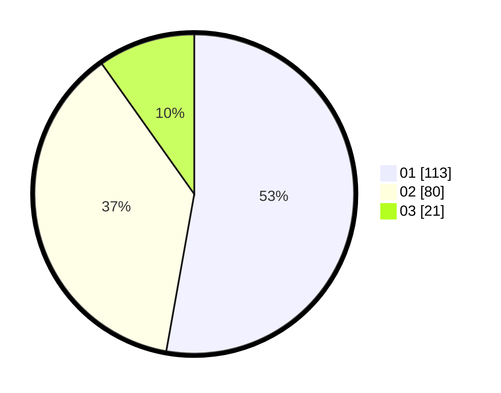

# Hasil

Hasil perolehan suara paslon dapat dilihat pada file paslon-01.txt, paslon-02.txt, dan paslon-03.txt.

Jika tidak ada, artinya data tersebut belum ada pada SIREKAP.

## Perolehan Suara

 * Paslon 01: **113**.
 * Paslon 02: **80**.
 * Paslon 03: **21**.

## Foto C Plano

https://sirekap-obj-formc.kpu.go.id/fff7/pemilu/ppwp/31/73/01/10/02/3173011002231-20240216-092714--86eded16-6dbb-4593-b390-cfbf300ed1f0.jpg

https://sirekap-obj-formc.kpu.go.id/fff7/pemilu/ppwp/31/73/01/10/02/3173011002231-20240216-092715--bf171780-8096-40a4-9aec-3aed662b0dfc.jpg

https://sirekap-obj-formc.kpu.go.id/fff7/pemilu/ppwp/31/73/01/10/02/3173011002231-20240216-092714--03da1cbf-1ed1-4baf-b19e-3cfab2ff4c02.jpg

## DATA PEMILIH TETAP

Jumlah pemilih dalam DPT: **271**.
 * L: **139**.
 * P: **132**.

## DATA PENGGUNA HAK PILIH

Jumlah pengguna hak pilih dalam DPT: **211**.
 * L: **103**.
 * P: **108**.

Jumlah pengguna hak pilih dalam DPTb: **2**.
 * L: **1**.
 * P: **1**.

Jumlah pengguna hak pilih dalam DPK: **2**.
 * L: **1**.
 * P: **1**.

Jumlah pengguna hak pilih: **215**.
 * L: **105**.
 * P: **110**.

## JUMLAH SUARA SAH DAN TIDAK SAH

JUMLAH SELURUH SUARA SAH: **214**.

JUMLAH SUARA TIDAK SAH: **1**.

JUMLAH SELURUH SUARA SAH DAN SUARA TIDAK SAH: **215**.
