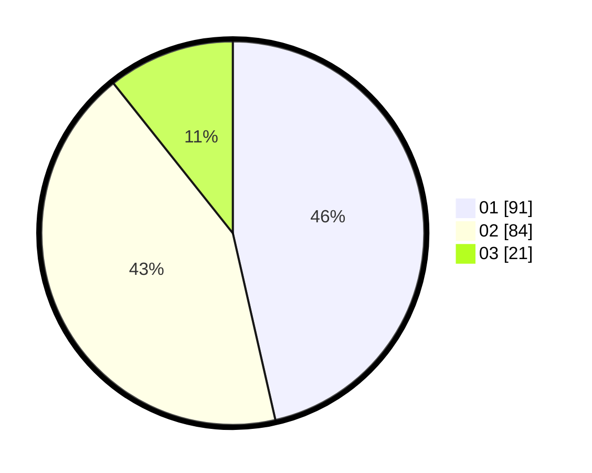

# Hasil

Hasil perolehan suara paslon dapat dilihat pada file paslon-01.txt, paslon-02.txt, dan paslon-03.txt.

Jika tidak ada, artinya data tersebut belum ada pada SIREKAP.

## Perolehan Suara

 * Paslon 01: **91**.
 * Paslon 02: **84**.
 * Paslon 03: **21**.

## Foto C Plano

https://sirekap-obj-formc.kpu.go.id/6de6/pemilu/ppwp/31/73/01/10/02/3173011002233-20240214-191703--c9a5b8b5-431b-4039-b0ae-5ca8774f2350.jpg

https://sirekap-obj-formc.kpu.go.id/6de6/pemilu/ppwp/31/73/01/10/02/3173011002233-20240214-191718--727a2f34-6ee1-4c52-963b-d59469e5aa95.jpg

https://sirekap-obj-formc.kpu.go.id/6de6/pemilu/ppwp/31/73/01/10/02/3173011002233-20240214-191747--2cac884b-7171-445e-b097-e7339a73f952.jpg
