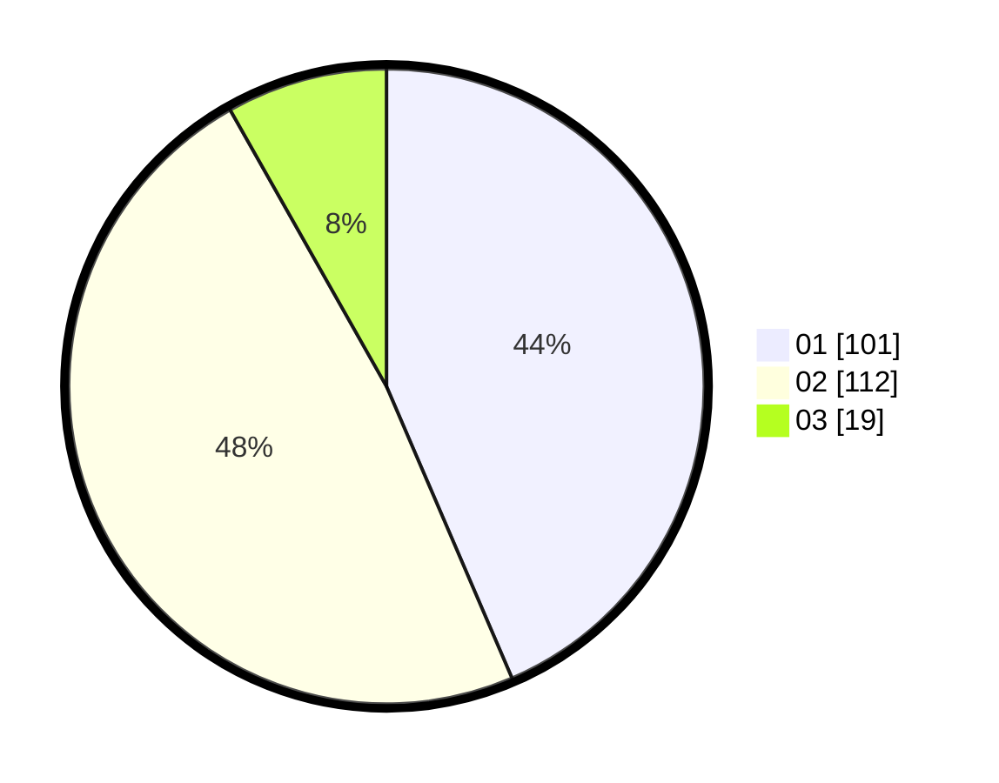

# Hasil

Hasil perolehan suara paslon dapat dilihat pada file paslon-01.txt, paslon-02.txt, dan paslon-03.txt.

Jika tidak ada, artinya data tersebut belum ada pada SIREKAP.

## Perolehan Suara

 * Paslon 01: **101**.
 * Paslon 02: **112**.
 * Paslon 03: **19**.

## Foto C Plano

https://sirekap-obj-formc.kpu.go.id/2c56/pemilu/ppwp/31/73/01/10/02/3173011002234-20240214-201033--a23a4c58-6cbd-45b2-9ddc-e7db2e26d222.jpg

https://sirekap-obj-formc.kpu.go.id/2c56/pemilu/ppwp/31/73/01/10/02/3173011002234-20240214-211702--ce8f7ee2-720f-4fd9-97dd-0d5781bb8109.jpg

https://sirekap-obj-formc.kpu.go.id/2c56/pemilu/ppwp/31/73/01/10/02/3173011002234-20240214-201050--dfc87706-6ccb-4f53-9630-283e74a5c83e.jpg
