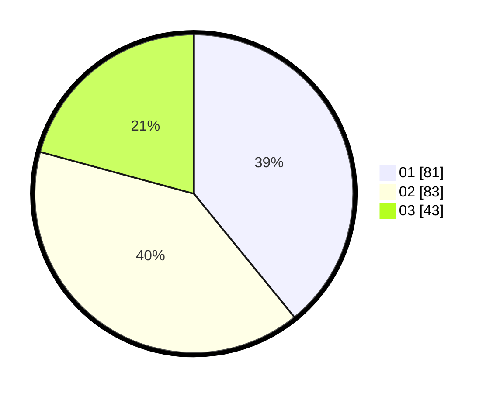

# Hasil

Hasil perolehan suara paslon dapat dilihat pada file paslon-01.txt, paslon-02.txt, dan paslon-03.txt.

Jika tidak ada, artinya data tersebut belum ada pada SIREKAP.

## Perolehan Suara

 * Paslon 01: **81**.
 * Paslon 02: **83**.
 * Paslon 03: **43**.

## Foto C Plano

https://sirekap-obj-formc.kpu.go.id/ab3f/pemilu/ppwp/31/73/01/10/02/3173011002238-20240214-220120--34654a88-c10d-4616-8779-77b7add53855.jpg

https://sirekap-obj-formc.kpu.go.id/ab3f/pemilu/ppwp/31/73/01/10/02/3173011002238-20240214-220301--9b58bf45-9830-4642-a325-b6fd57f378a2.jpg

https://sirekap-obj-formc.kpu.go.id/ab3f/pemilu/ppwp/31/73/01/10/02/3173011002238-20240214-220423--2c44b551-679e-4b57-bd33-46e4db73f389.jpg

## DATA PEMILIH TETAP

Jumlah pemilih dalam DPT: **259**.
 * L: **132**.
 * P: **127**.

## DATA PENGGUNA HAK PILIH

Jumlah pengguna hak pilih dalam DPT: **198**.
 * L: **91**.
 * P: **107**.

Jumlah pengguna hak pilih dalam DPTb: **4**.
 * L: **2**.
 * P: **2**.

Jumlah pengguna hak pilih dalam DPK: **5**.
 * L: **3**.
 * P: **2**.

Jumlah pengguna hak pilih: **207**.
 * L: **96**.
 * P: **111**.

## JUMLAH SUARA SAH DAN TIDAK SAH

JUMLAH SELURUH SUARA SAH: **207**.

JUMLAH SUARA TIDAK SAH: **0**.

JUMLAH SELURUH SUARA SAH DAN SUARA TIDAK SAH: **207**.
