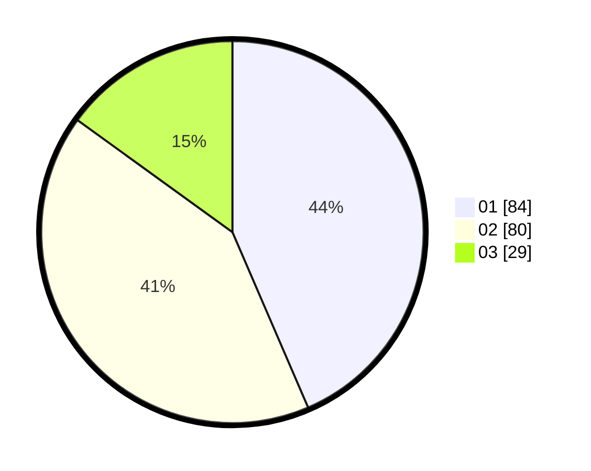

# Hasil

Hasil perolehan suara paslon dapat dilihat pada file paslon-01.txt, paslon-02.txt, dan paslon-03.txt.

Jika tidak ada, artinya data tersebut belum ada pada SIREKAP.

## Perolehan Suara

 * Paslon 01: **84**.
 * Paslon 02: **80**.
 * Paslon 03: **29**.

## Foto C Plano

https://sirekap-obj-formc.kpu.go.id/8c34/pemilu/ppwp/31/73/01/10/02/3173011002239-20240214-224107--5c4733bf-1347-46a9-a757-b0bac9ba4f9b.jpg

https://sirekap-obj-formc.kpu.go.id/8c34/pemilu/ppwp/31/73/01/10/02/3173011002239-20240214-234504--61b2577c-1e49-41aa-b93b-2b8f7cb70869.jpg

https://sirekap-obj-formc.kpu.go.id/8c34/pemilu/ppwp/31/73/01/10/02/3173011002239-20240214-234646--4a7ee15f-ec9e-469e-89cb-40dcb29abfc0.jpg
