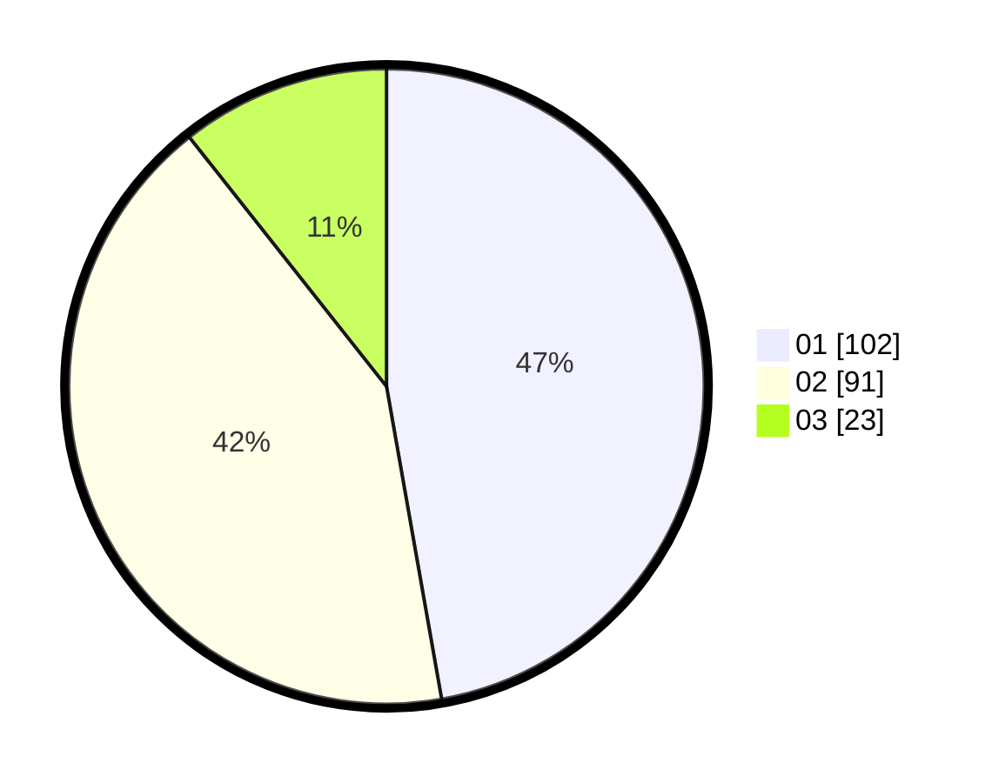

# Hasil

Hasil perolehan suara paslon dapat dilihat pada file paslon-01.txt, paslon-02.txt, dan paslon-03.txt.

Jika tidak ada, artinya data tersebut belum ada pada SIREKAP.

## Perolehan Suara

 * Paslon 01: **102**.
 * Paslon 02: **91**.
 * Paslon 03: **23**.

## Foto C Plano

https://sirekap-obj-formc.kpu.go.id/4216/pemilu/ppwp/31/73/01/10/02/3173011002241-20240216-033621--4512f22b-20da-465b-9644-5e46d55b6dc5.jpg

https://sirekap-obj-formc.kpu.go.id/4216/pemilu/ppwp/31/73/01/10/02/3173011002241-20240216-033632--598b3edf-a3ed-4db0-98da-b83db1d3b4f4.jpg

https://sirekap-obj-formc.kpu.go.id/4216/pemilu/ppwp/31/73/01/10/02/3173011002241-20240216-033627--38b77054-15e8-49da-824a-309214ccb85b.jpg

## DATA PEMILIH TETAP

Jumlah pemilih dalam DPT: **267**.
 * L: **143**.
 * P: **124**.

## DATA PENGGUNA HAK PILIH

Jumlah pengguna hak pilih dalam DPT: **217**.
 * L: **117**.
 * P: **100**.

Jumlah pengguna hak pilih dalam DPTb: **1**.
 * L: **1**.
 * P: **0**.

Jumlah pengguna hak pilih dalam DPK: **0**.
 * L: **0**.
 * P: **0**.

Jumlah pengguna hak pilih: **218**.
 * L: **118**.
 * P: **100**.

## JUMLAH SUARA SAH DAN TIDAK SAH

JUMLAH SELURUH SUARA SAH: **216**.

JUMLAH SUARA TIDAK SAH: **2**.

JUMLAH SELURUH SUARA SAH DAN SUARA TIDAK SAH: **218**.
