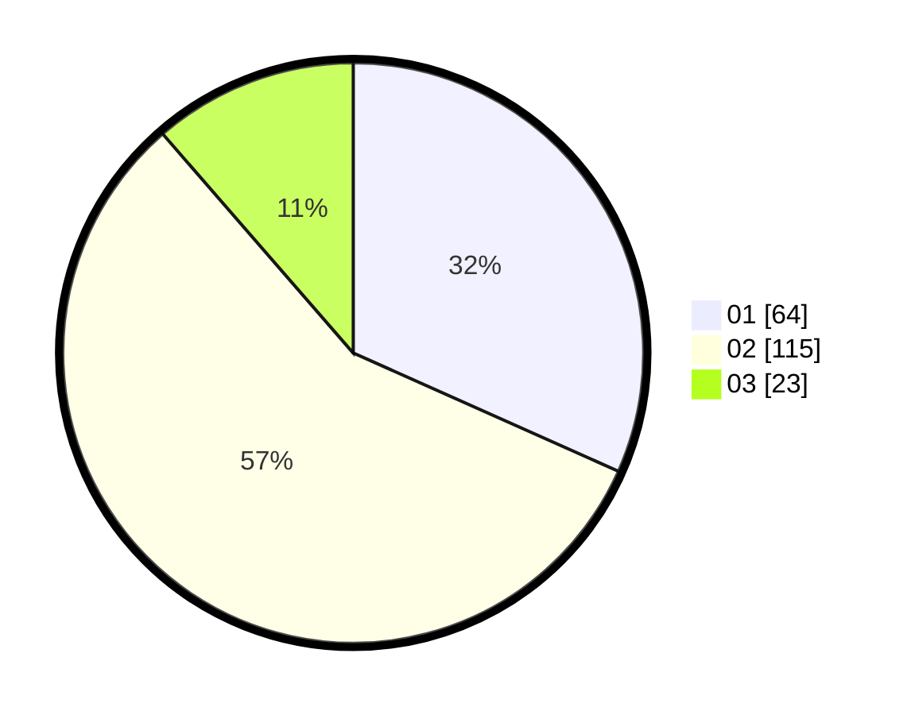

# Hasil

Hasil perolehan suara paslon dapat dilihat pada file paslon-01.txt, paslon-02.txt, dan paslon-03.txt.

Jika tidak ada, artinya data tersebut belum ada pada SIREKAP.

## Perolehan Suara

 * Paslon 01: **64**.
 * Paslon 02: **115**.
 * Paslon 03: **23**.

## Foto C Plano

https://sirekap-obj-formc.kpu.go.id/2039/pemilu/ppwp/31/73/01/10/02/3173011002252-20240216-040211--bde2a8b1-9245-4c1a-b6e0-fb110821e99d.jpg

https://sirekap-obj-formc.kpu.go.id/2039/pemilu/ppwp/31/73/01/10/02/3173011002252-20240216-040213--caa062b2-5247-4408-8577-aeb3828ea4f7.jpg

https://sirekap-obj-formc.kpu.go.id/2039/pemilu/ppwp/31/73/01/10/02/3173011002252-20240216-040212--6ed43af3-0a89-4d48-9939-6d64b0def107.jpg

## DATA PEMILIH TETAP

Jumlah pemilih dalam DPT: **262**.
 * L: **124**.
 * P: **138**.

## DATA PENGGUNA HAK PILIH

Jumlah pengguna hak pilih dalam DPT: **200**.
 * L: **93**.
 * P: **107**.

Jumlah pengguna hak pilih dalam DPTb: **0**.
 * L: **0**.
 * P: **0**.

Jumlah pengguna hak pilih dalam DPK: **4**.
 * L: **1**.
 * P: **3**.

Jumlah pengguna hak pilih: **204**.
 * L: **94**.
 * P: **110**.

## JUMLAH SUARA SAH DAN TIDAK SAH

JUMLAH SELURUH SUARA SAH: **202**.

JUMLAH SUARA TIDAK SAH: **2**.

JUMLAH SELURUH SUARA SAH DAN SUARA TIDAK SAH: **204**.
