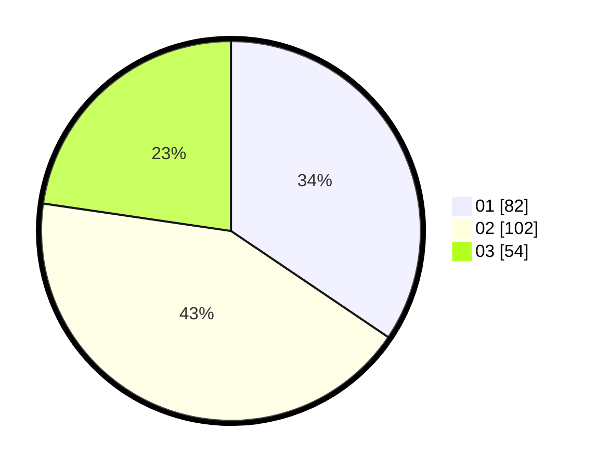

# Hasil

Hasil perolehan suara paslon dapat dilihat pada file paslon-01.txt, paslon-02.txt, dan paslon-03.txt.

Jika tidak ada, artinya data tersebut belum ada pada SIREKAP.

## Perolehan Suara

 * Paslon 01: **82**.
 * Paslon 02: **102**.
 * Paslon 03: **54**.

## Foto C Plano

https://sirekap-obj-formc.kpu.go.id/a4af/pemilu/ppwp/31/73/01/10/02/3173011002255-20240219-110639--f116ccf7-73b1-4476-a4a7-0ba49b81230d.jpg

https://sirekap-obj-formc.kpu.go.id/a4af/pemilu/ppwp/31/73/01/10/02/3173011002255-20240219-110640--27c43e92-e9b4-4b4b-9dcb-bfdaaa9a5567.jpg

https://sirekap-obj-formc.kpu.go.id/a4af/pemilu/ppwp/31/73/01/10/02/3173011002255-20240219-110639--e87ea8d9-dcec-43b1-a03e-eac3b937a85e.jpg

## DATA PEMILIH TETAP

Jumlah pemilih dalam DPT: **241**.
 * L: **125**.
 * P: **116**.

## DATA PENGGUNA HAK PILIH

Jumlah pengguna hak pilih dalam DPT: **241**.
 * L: **125**.
 * P: **116**.

Jumlah pengguna hak pilih dalam DPTb: **0**.
 * L: **0**.
 * P: **0**.

Jumlah pengguna hak pilih dalam DPK: **0**.
 * L: **0**.
 * P: **0**.

Jumlah pengguna hak pilih: **241**.
 * L: **125**.
 * P: **116**.

## JUMLAH SUARA SAH DAN TIDAK SAH

JUMLAH SELURUH SUARA SAH: **238**.

JUMLAH SUARA TIDAK SAH: **3**.

JUMLAH SELURUH SUARA SAH DAN SUARA TIDAK SAH: **241**.
