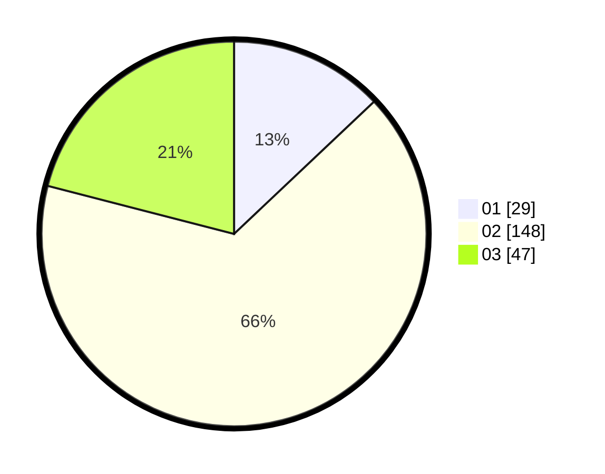

# Hasil

Hasil perolehan suara paslon dapat dilihat pada file paslon-01.txt, paslon-02.txt, dan paslon-03.txt.

Jika tidak ada, artinya data tersebut belum ada pada SIREKAP.

## Perolehan Suara

 * Paslon 01: **29**.
 * Paslon 02: **148**.
 * Paslon 03: **47**.

## Foto C Plano

https://sirekap-obj-formc.kpu.go.id/a9d5/pemilu/ppwp/31/73/01/10/02/3173011002256-20240215-122120--68d6735e-23dc-4ec1-8a3c-34ef79a51b5e.jpg

https://sirekap-obj-formc.kpu.go.id/a9d5/pemilu/ppwp/31/73/01/10/02/3173011002256-20240215-175225--a735534d-1661-44c0-9584-a7760e780749.jpg

https://sirekap-obj-formc.kpu.go.id/a9d5/pemilu/ppwp/31/73/01/10/02/3173011002256-20240215-122212--0e8dae3b-f9e6-4c4b-904e-83708c58d819.jpg

## DATA PEMILIH TETAP

Jumlah pemilih dalam DPT: **269**.
 * L: **142**.
 * P: **127**.

## DATA PENGGUNA HAK PILIH

Jumlah pengguna hak pilih dalam DPT: **223**.
 * L: **111**.
 * P: **112**.

Jumlah pengguna hak pilih dalam DPTb: **0**.
 * L: **0**.
 * P: **0**.

Jumlah pengguna hak pilih dalam DPK: **3**.
 * L: **2**.
 * P: **1**.

Jumlah pengguna hak pilih: **226**.
 * L: **113**.
 * P: **113**.

## JUMLAH SUARA SAH DAN TIDAK SAH

JUMLAH SELURUH SUARA SAH: **224**.

JUMLAH SUARA TIDAK SAH: **2**.

JUMLAH SELURUH SUARA SAH DAN SUARA TIDAK SAH: **226**.
