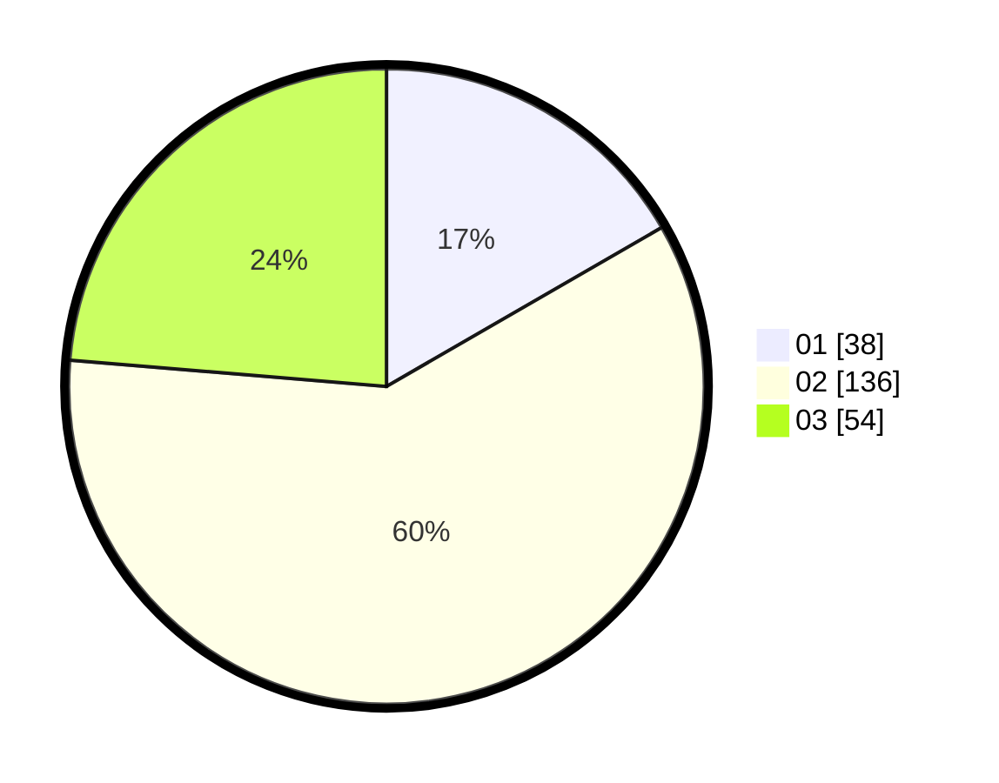

# Hasil

Hasil perolehan suara paslon dapat dilihat pada file paslon-01.txt, paslon-02.txt, dan paslon-03.txt.

Jika tidak ada, artinya data tersebut belum ada pada SIREKAP.

## Perolehan Suara

 * Paslon 01: **38**.
 * Paslon 02: **136**.
 * Paslon 03: **54**.

## Foto C Plano

https://sirekap-obj-formc.kpu.go.id/86fe/pemilu/ppwp/31/73/01/10/02/3173011002257-20240214-155310--082857ef-e19c-4476-8c9c-d2567ae2b9b7.jpg

https://sirekap-obj-formc.kpu.go.id/86fe/pemilu/ppwp/31/73/01/10/02/3173011002257-20240214-155350--0403dc1c-730b-4fc0-8763-bec1c9b008f0.jpg

https://sirekap-obj-formc.kpu.go.id/86fe/pemilu/ppwp/31/73/01/10/02/3173011002257-20240214-155500--07ec604d-8281-4ff4-beb2-3ea0104b1f72.jpg
