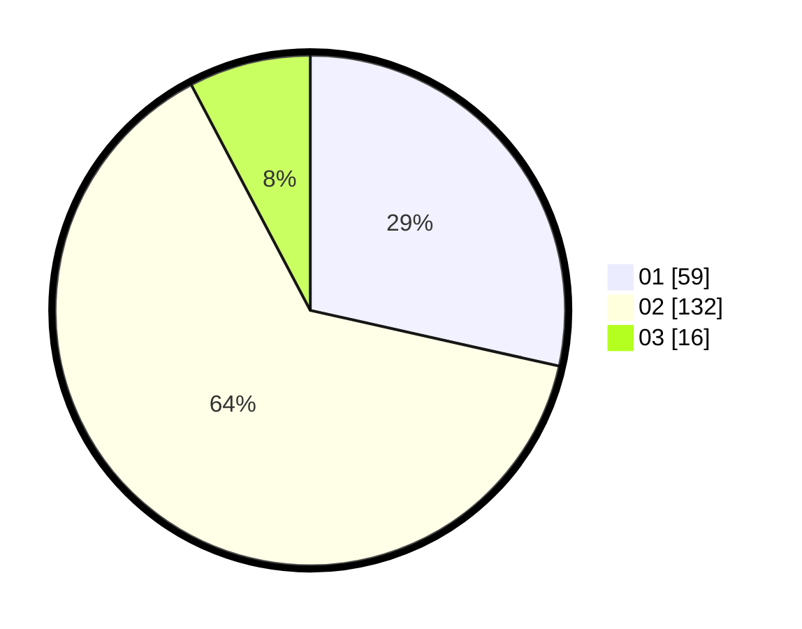

# Hasil

Hasil perolehan suara paslon dapat dilihat pada file paslon-01.txt, paslon-02.txt, dan paslon-03.txt.

Jika tidak ada, artinya data tersebut belum ada pada SIREKAP.

## Perolehan Suara

 * Paslon 01: **59**.
 * Paslon 02: **132**.
 * Paslon 03: **16**.

## Foto C Plano

https://sirekap-obj-formc.kpu.go.id/6af8/pemilu/ppwp/31/73/01/10/02/3173011002259-20240214-160101--abaf1a3a-0f6f-40cf-afd4-813fadde287a.jpg

https://sirekap-obj-formc.kpu.go.id/6af8/pemilu/ppwp/31/73/01/10/02/3173011002259-20240214-155617--a03c2ce8-7e6b-458f-9f85-f6d11a1cd9c6.jpg
