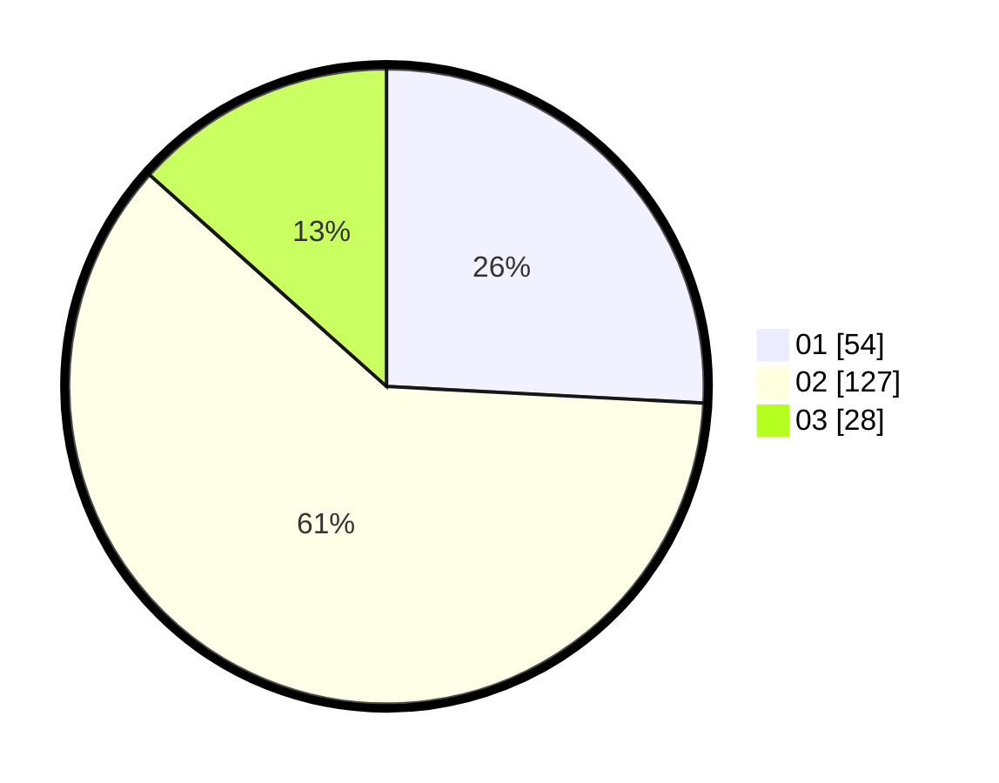

# Hasil

Hasil perolehan suara paslon dapat dilihat pada file paslon-01.txt, paslon-02.txt, dan paslon-03.txt.

Jika tidak ada, artinya data tersebut belum ada pada SIREKAP.

## Perolehan Suara

 * Paslon 01: **54**.
 * Paslon 02: **127**.
 * Paslon 03: **28**.

## Foto C Plano

https://sirekap-obj-formc.kpu.go.id/e12d/pemilu/ppwp/31/73/01/10/02/3173011002261-20240216-140457--3e992f26-1a97-46c7-b3b8-8e994779e4d0.jpg

https://sirekap-obj-formc.kpu.go.id/e12d/pemilu/ppwp/31/73/01/10/02/3173011002261-20240216-140459--9391f1e9-e8b2-4520-b138-f92d6303d3e4.jpg

https://sirekap-obj-formc.kpu.go.id/e12d/pemilu/ppwp/31/73/01/10/02/3173011002261-20240216-140458--8da05434-fbca-4d4b-a41e-7716587571d7.jpg

## DATA PEMILIH TETAP

Jumlah pemilih dalam DPT: **266**.
 * L: **133**.
 * P: **133**.

## DATA PENGGUNA HAK PILIH

Jumlah pengguna hak pilih dalam DPT: **213**.
 * L: **110**.
 * P: **103**.

Jumlah pengguna hak pilih dalam DPTb: **0**.
 * L: **0**.
 * P: **0**.

Jumlah pengguna hak pilih dalam DPK: **1**.
 * L: **0**.
 * P: **1**.

Jumlah pengguna hak pilih: **214**.
 * L: **110**.
 * P: **104**.

## JUMLAH SUARA SAH DAN TIDAK SAH

JUMLAH SELURUH SUARA SAH: **209**.

JUMLAH SUARA TIDAK SAH: **5**.

JUMLAH SELURUH SUARA SAH DAN SUARA TIDAK SAH: **214**.
