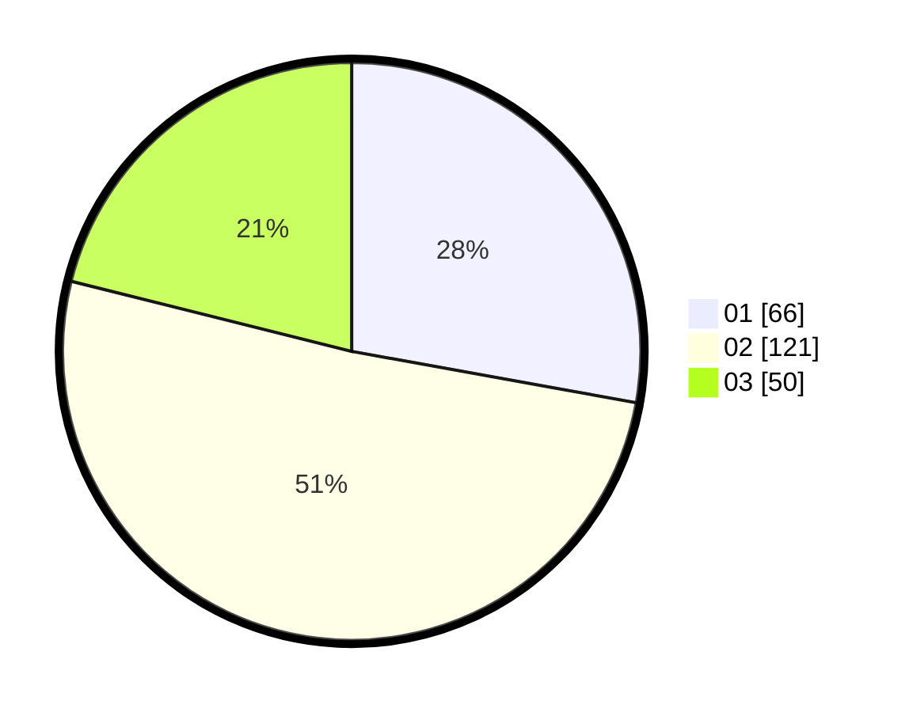

# Hasil

Hasil perolehan suara paslon dapat dilihat pada file paslon-01.txt, paslon-02.txt, dan paslon-03.txt.

Jika tidak ada, artinya data tersebut belum ada pada SIREKAP.

## Perolehan Suara

 * Paslon 01: **66**.
 * Paslon 02: **121**.
 * Paslon 03: **50**.

## Foto C Plano

https://sirekap-obj-formc.kpu.go.id/3712/pemilu/ppwp/31/73/01/10/02/3173011002265-20240214-210855--ece991d7-dd3d-422c-82fa-c01147c2a63f.jpg

https://sirekap-obj-formc.kpu.go.id/3712/pemilu/ppwp/31/73/01/10/02/3173011002265-20240214-211013--298a26c3-1627-4c9c-a5b3-876f7110fa72.jpg

https://sirekap-obj-formc.kpu.go.id/3712/pemilu/ppwp/31/73/01/10/02/3173011002265-20240214-223332--04efd452-c431-4c37-809c-b26f08f4922b.jpg

## DATA PEMILIH TETAP

Jumlah pemilih dalam DPT: **272**.
 * L: **131**.
 * P: **141**.

## DATA PENGGUNA HAK PILIH

Jumlah pengguna hak pilih dalam DPT: **221**.
 * L: **104**.
 * P: **117**.

Jumlah pengguna hak pilih dalam DPTb: **5**.
 * L: **2**.
 * P: **3**.

Jumlah pengguna hak pilih dalam DPK: **14**.
 * L: **8**.
 * P: **6**.

Jumlah pengguna hak pilih: **240**.
 * L: **114**.
 * P: **126**.

## JUMLAH SUARA SAH DAN TIDAK SAH

JUMLAH SELURUH SUARA SAH: **237**.

JUMLAH SUARA TIDAK SAH: **3**.

JUMLAH SELURUH SUARA SAH DAN SUARA TIDAK SAH: **240**.
