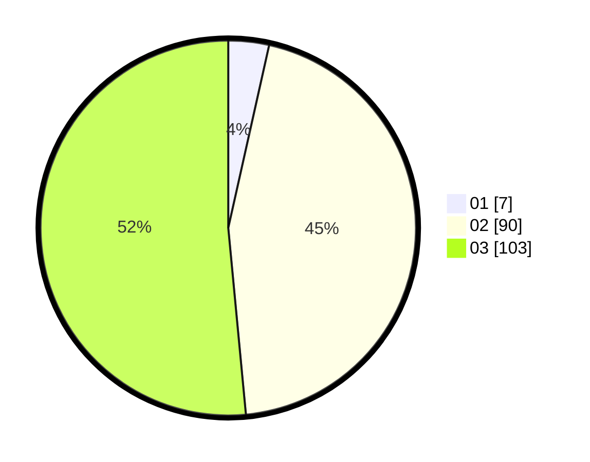

# Hasil

Hasil perolehan suara paslon dapat dilihat pada file paslon-01.txt, paslon-02.txt, dan paslon-03.txt.

Jika tidak ada, artinya data tersebut belum ada pada SIREKAP.

## Perolehan Suara

 * Paslon 01: **7**.
 * Paslon 02: **90**.
 * Paslon 03: **103**.

## Foto C Plano

https://sirekap-obj-formc.kpu.go.id/423b/pemilu/ppwp/31/73/01/10/02/3173011002269-20240214-200959--6ce094f7-284d-464e-9476-1f3fe28bb41f.jpg

https://sirekap-obj-formc.kpu.go.id/423b/pemilu/ppwp/31/73/01/10/02/3173011002269-20240214-201031--e34a717e-87b7-44f4-a1d7-b6eda630f5c5.jpg

https://sirekap-obj-formc.kpu.go.id/423b/pemilu/ppwp/31/73/01/10/02/3173011002269-20240214-201053--1e3fc11d-180d-435b-a009-7de6ed2de812.jpg

## DATA PEMILIH TETAP

Jumlah pemilih dalam DPT: **272**.
 * L: **135**.
 * P: **137**.

## DATA PENGGUNA HAK PILIH

Jumlah pengguna hak pilih dalam DPT: **199**.
 * L: **90**.
 * P: **109**.

Jumlah pengguna hak pilih dalam DPTb: **2**.
 * L: **2**.
 * P: **0**.

Jumlah pengguna hak pilih dalam DPK: **1**.
 * L: **0**.
 * P: **1**.

Jumlah pengguna hak pilih: **202**.
 * L: **92**.
 * P: **110**.

## JUMLAH SUARA SAH DAN TIDAK SAH

JUMLAH SELURUH SUARA SAH: **200**.

JUMLAH SUARA TIDAK SAH: **2**.

JUMLAH SELURUH SUARA SAH DAN SUARA TIDAK SAH: **202**.
