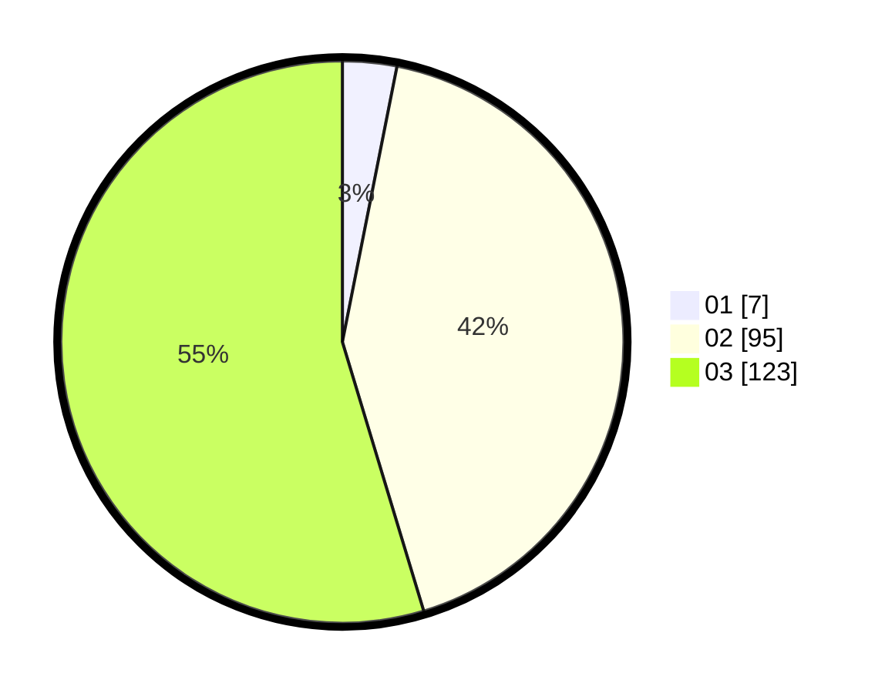

# Hasil

Hasil perolehan suara paslon dapat dilihat pada file paslon-01.txt, paslon-02.txt, dan paslon-03.txt.

Jika tidak ada, artinya data tersebut belum ada pada SIREKAP.

## Perolehan Suara

 * Paslon 01: **7**.
 * Paslon 02: **95**.
 * Paslon 03: **123**.

## Foto C Plano

https://sirekap-obj-formc.kpu.go.id/070e/pemilu/ppwp/31/73/01/10/02/3173011002270-20240215-221341--51aa0b9b-5025-43e0-be64-5a72116cd295.jpg

https://sirekap-obj-formc.kpu.go.id/070e/pemilu/ppwp/31/73/01/10/02/3173011002270-20240215-221342--04900628-319b-4556-82cc-25fe59b45ba4.jpg

https://sirekap-obj-formc.kpu.go.id/070e/pemilu/ppwp/31/73/01/10/02/3173011002270-20240214-194337--f9a07618-9a07-4fbd-b3cd-319b7a7b38c2.jpg

## DATA PEMILIH TETAP

Jumlah pemilih dalam DPT: **274**.
 * L: **135**.
 * P: **139**.

## DATA PENGGUNA HAK PILIH

Jumlah pengguna hak pilih dalam DPT: **211**.
 * L: **103**.
 * P: **108**.

Jumlah pengguna hak pilih dalam DPTb: **14**.
 * L: **4**.
 * P: **10**.

Jumlah pengguna hak pilih dalam DPK: **2**.
 * L: **1**.
 * P: **1**.

Jumlah pengguna hak pilih: **227**.
 * L: **108**.
 * P: **119**.

## JUMLAH SUARA SAH DAN TIDAK SAH

JUMLAH SELURUH SUARA SAH: **225**.

JUMLAH SUARA TIDAK SAH: **2**.

JUMLAH SELURUH SUARA SAH DAN SUARA TIDAK SAH: **227**.
