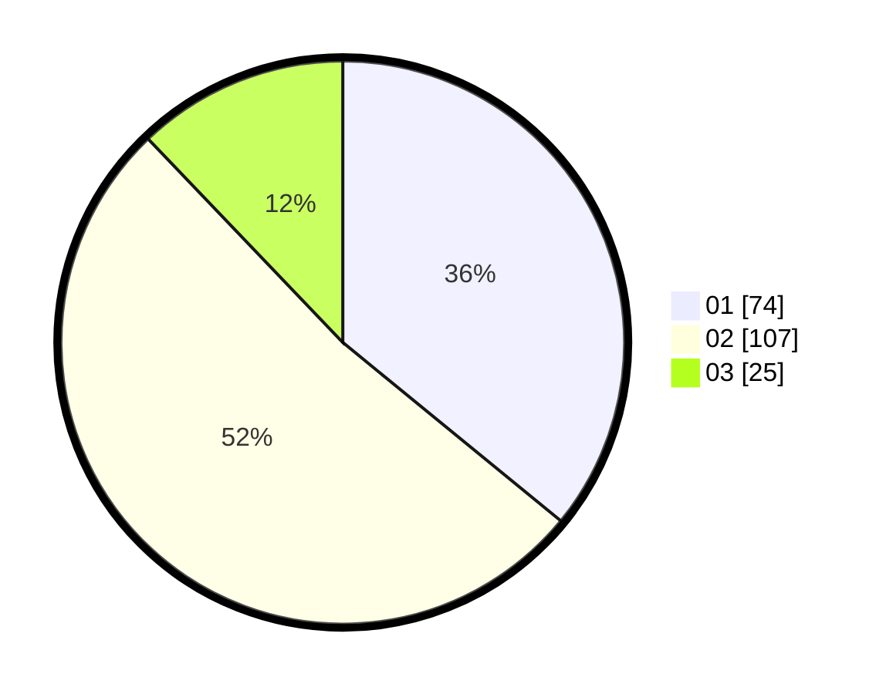

# Hasil

Hasil perolehan suara paslon dapat dilihat pada file paslon-01.txt, paslon-02.txt, dan paslon-03.txt.

Jika tidak ada, artinya data tersebut belum ada pada SIREKAP.

## Perolehan Suara

 * Paslon 01: **74**.
 * Paslon 02: **107**.
 * Paslon 03: **25**.

## Foto C Plano

https://sirekap-obj-formc.kpu.go.id/265a/pemilu/ppwp/31/73/01/10/03/3173011003008-20240216-053826--5ed79218-4e93-4bc6-9a12-e192f8c9ee08.jpg

https://sirekap-obj-formc.kpu.go.id/265a/pemilu/ppwp/31/73/01/10/03/3173011003008-20240216-053828--210eae4d-6717-4fa6-9033-0c8ac73d7df0.jpg

https://sirekap-obj-formc.kpu.go.id/265a/pemilu/ppwp/31/73/01/10/03/3173011003008-20240216-053827--14b055db-adb9-46c1-a5e4-b8f2caf37ed7.jpg

## DATA PEMILIH TETAP

Jumlah pemilih dalam DPT: **279**.
 * L: **135**.
 * P: **144**.

## DATA PENGGUNA HAK PILIH

Jumlah pengguna hak pilih dalam DPT: **202**.
 * L: **97**.
 * P: **105**.

Jumlah pengguna hak pilih dalam DPTb: **2**.
 * L: **1**.
 * P: **1**.

Jumlah pengguna hak pilih dalam DPK: **3**.
 * L: **1**.
 * P: **2**.

Jumlah pengguna hak pilih: **207**.
 * L: **99**.
 * P: **108**.

## JUMLAH SUARA SAH DAN TIDAK SAH

JUMLAH SELURUH SUARA SAH: **206**.

JUMLAH SUARA TIDAK SAH: **1**.

JUMLAH SELURUH SUARA SAH DAN SUARA TIDAK SAH: **207**.
