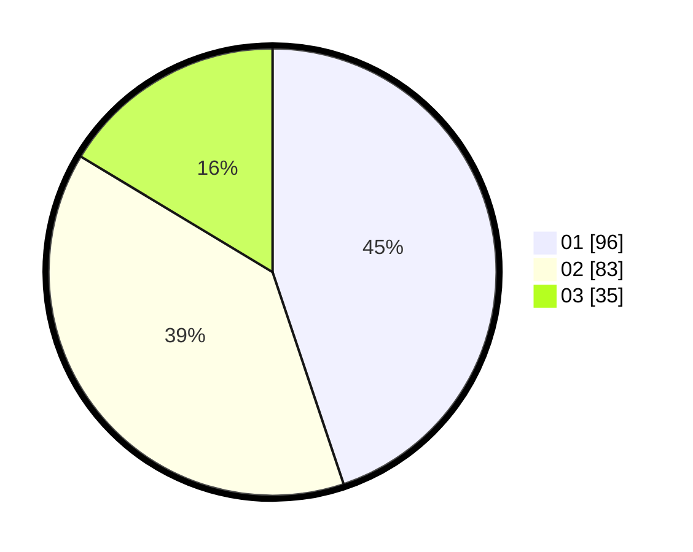

# Hasil

Hasil perolehan suara paslon dapat dilihat pada file paslon-01.txt, paslon-02.txt, dan paslon-03.txt.

Jika tidak ada, artinya data tersebut belum ada pada SIREKAP.

## Perolehan Suara

 * Paslon 01: **96**.
 * Paslon 02: **83**.
 * Paslon 03: **35**.

## Foto C Plano

https://sirekap-obj-formc.kpu.go.id/0b17/pemilu/ppwp/31/73/01/10/03/3173011003009-20240214-214321--3dd8974e-cffe-4924-a2a6-9459c47d1f67.jpg

https://sirekap-obj-formc.kpu.go.id/0b17/pemilu/ppwp/31/73/01/10/03/3173011003009-20240214-214421--cdb5ed80-56d9-44bb-bef3-2f1a4af6f0ed.jpg

https://sirekap-obj-formc.kpu.go.id/0b17/pemilu/ppwp/31/73/01/10/03/3173011003009-20240214-214522--2161c9b5-6977-4715-b639-d8698f95436b.jpg

## DATA PEMILIH TETAP

Jumlah pemilih dalam DPT: **278**.
 * L: **141**.
 * P: **137**.

## DATA PENGGUNA HAK PILIH

Jumlah pengguna hak pilih dalam DPT: **212**.
 * L: **105**.
 * P: **107**.

Jumlah pengguna hak pilih dalam DPTb: **0**.
 * L: **0**.
 * P: **0**.

Jumlah pengguna hak pilih dalam DPK: **3**.
 * L: **1**.
 * P: **2**.

Jumlah pengguna hak pilih: **215**.
 * L: **106**.
 * P: **109**.

## JUMLAH SUARA SAH DAN TIDAK SAH

JUMLAH SELURUH SUARA SAH: **214**.

JUMLAH SUARA TIDAK SAH: **1**.

JUMLAH SELURUH SUARA SAH DAN SUARA TIDAK SAH: **215**.
