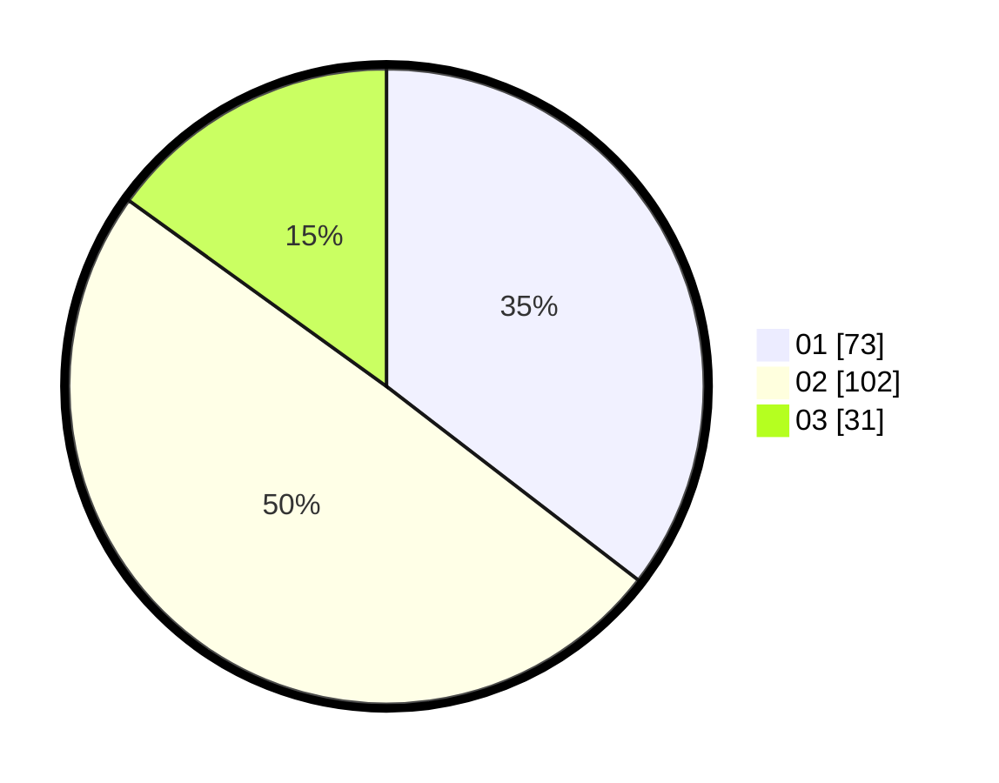

# Hasil

Hasil perolehan suara paslon dapat dilihat pada file paslon-01.txt, paslon-02.txt, dan paslon-03.txt.

Jika tidak ada, artinya data tersebut belum ada pada SIREKAP.

## Perolehan Suara

 * Paslon 01: **73**.
 * Paslon 02: **102**.
 * Paslon 03: **31**.

## Foto C Plano

https://sirekap-obj-formc.kpu.go.id/a96e/pemilu/ppwp/31/73/01/10/03/3173011003017-20240216-133225--ed01879c-7153-42ee-81e7-710a4d037216.jpg

https://sirekap-obj-formc.kpu.go.id/a96e/pemilu/ppwp/31/73/01/10/03/3173011003017-20240216-133227--58b920c6-a2cf-4e11-9b86-36c69359940b.jpg

https://sirekap-obj-formc.kpu.go.id/a96e/pemilu/ppwp/31/73/01/10/03/3173011003017-20240216-133226--680cce75-78ed-4a76-8f41-b38dc925338c.jpg

## DATA PEMILIH TETAP

Jumlah pemilih dalam DPT: **289**.
 * L: **147**.
 * P: **142**.

## DATA PENGGUNA HAK PILIH

Jumlah pengguna hak pilih dalam DPT: **208**.
 * L: **101**.
 * P: **107**.

Jumlah pengguna hak pilih dalam DPTb: **0**.
 * L: **0**.
 * P: **0**.

Jumlah pengguna hak pilih dalam DPK: **0**.
 * L: **0**.
 * P: **0**.

Jumlah pengguna hak pilih: **208**.
 * L: **101**.
 * P: **107**.

## JUMLAH SUARA SAH DAN TIDAK SAH

JUMLAH SELURUH SUARA SAH: **206**.

JUMLAH SUARA TIDAK SAH: **2**.

JUMLAH SELURUH SUARA SAH DAN SUARA TIDAK SAH: **208**.
