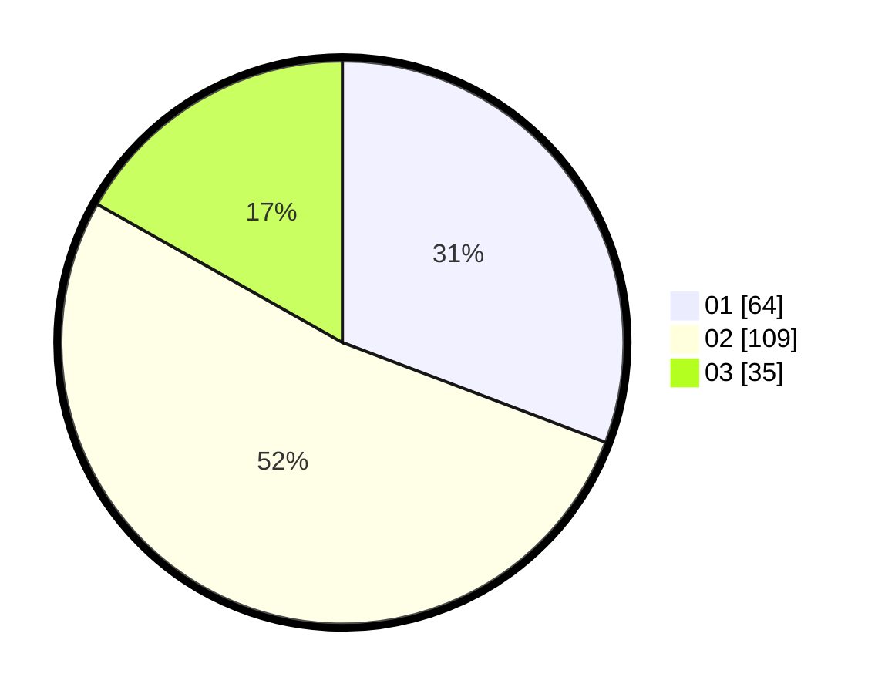

# Hasil

Hasil perolehan suara paslon dapat dilihat pada file paslon-01.txt, paslon-02.txt, dan paslon-03.txt.

Jika tidak ada, artinya data tersebut belum ada pada SIREKAP.

## Perolehan Suara

 * Paslon 01: **64**.
 * Paslon 02: **109**.
 * Paslon 03: **35**.

## Foto C Plano

https://sirekap-obj-formc.kpu.go.id/92d1/pemilu/ppwp/31/73/01/10/03/3173011003019-20240216-132151--0f9c418f-bee6-4d33-9761-cb39668241ed.jpg

https://sirekap-obj-formc.kpu.go.id/92d1/pemilu/ppwp/31/73/01/10/03/3173011003019-20240215-034245--f7fdd3ac-ac42-4fa3-b941-8e847b4ab90a.jpg

https://sirekap-obj-formc.kpu.go.id/92d1/pemilu/ppwp/31/73/01/10/03/3173011003019-20240216-132152--dc891941-a662-4cb7-8ed8-58be328619c4.jpg

## DATA PEMILIH TETAP

Jumlah pemilih dalam DPT: **273**.
 * L: **148**.
 * P: **125**.

## DATA PENGGUNA HAK PILIH

Jumlah pengguna hak pilih dalam DPT: **207**.
 * L: **110**.
 * P: **97**.

Jumlah pengguna hak pilih dalam DPTb: **0**.
 * L: **0**.
 * P: **0**.

Jumlah pengguna hak pilih dalam DPK: **2**.
 * L: **2**.
 * P: **0**.

Jumlah pengguna hak pilih: **209**.
 * L: **112**.
 * P: **97**.

## JUMLAH SUARA SAH DAN TIDAK SAH

JUMLAH SELURUH SUARA SAH: **208**.

JUMLAH SUARA TIDAK SAH: **1**.

JUMLAH SELURUH SUARA SAH DAN SUARA TIDAK SAH: **209**.
