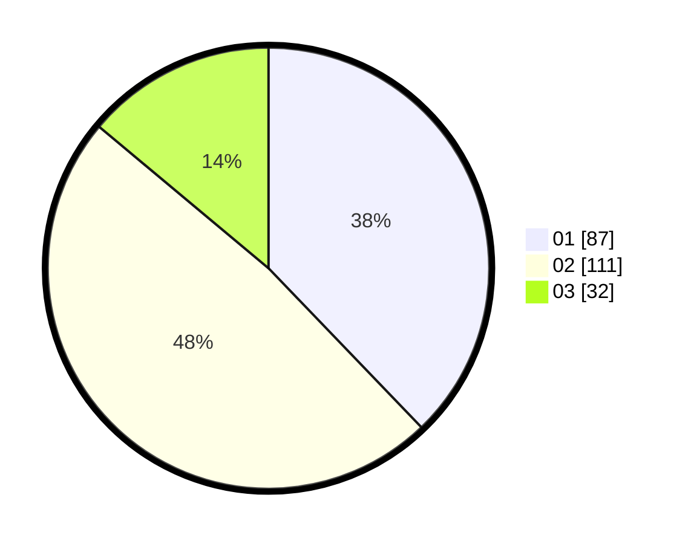

# Hasil

Hasil perolehan suara paslon dapat dilihat pada file paslon-01.txt, paslon-02.txt, dan paslon-03.txt.

Jika tidak ada, artinya data tersebut belum ada pada SIREKAP.

## Perolehan Suara

 * Paslon 01: **87**.
 * Paslon 02: **111**.
 * Paslon 03: **32**.

## Foto C Plano

https://sirekap-obj-formc.kpu.go.id/51a2/pemilu/ppwp/31/73/01/10/03/3173011003022-20240215-234056--3be1e925-ed48-43e1-8fd5-80d4fa8635cb.jpg

https://sirekap-obj-formc.kpu.go.id/51a2/pemilu/ppwp/31/73/01/10/03/3173011003022-20240215-234059--2f5640d3-1792-438a-80b9-3461560e7968.jpg

https://sirekap-obj-formc.kpu.go.id/51a2/pemilu/ppwp/31/73/01/10/03/3173011003022-20240215-234057--18f021e3-e058-4d5e-8025-244e212b54a8.jpg

## DATA PEMILIH TETAP

Jumlah pemilih dalam DPT: **294**.
 * L: **156**.
 * P: **138**.

## DATA PENGGUNA HAK PILIH

Jumlah pengguna hak pilih dalam DPT: **231**.
 * L: **133**.
 * P: **98**.

Jumlah pengguna hak pilih dalam DPTb: **0**.
 * L: **0**.
 * P: **0**.

Jumlah pengguna hak pilih dalam DPK: **1**.
 * L: **1**.
 * P: **0**.

Jumlah pengguna hak pilih: **232**.
 * L: **134**.
 * P: **98**.

## JUMLAH SUARA SAH DAN TIDAK SAH

JUMLAH SELURUH SUARA SAH: **230**.

JUMLAH SUARA TIDAK SAH: **2**.

JUMLAH SELURUH SUARA SAH DAN SUARA TIDAK SAH: **232**.
