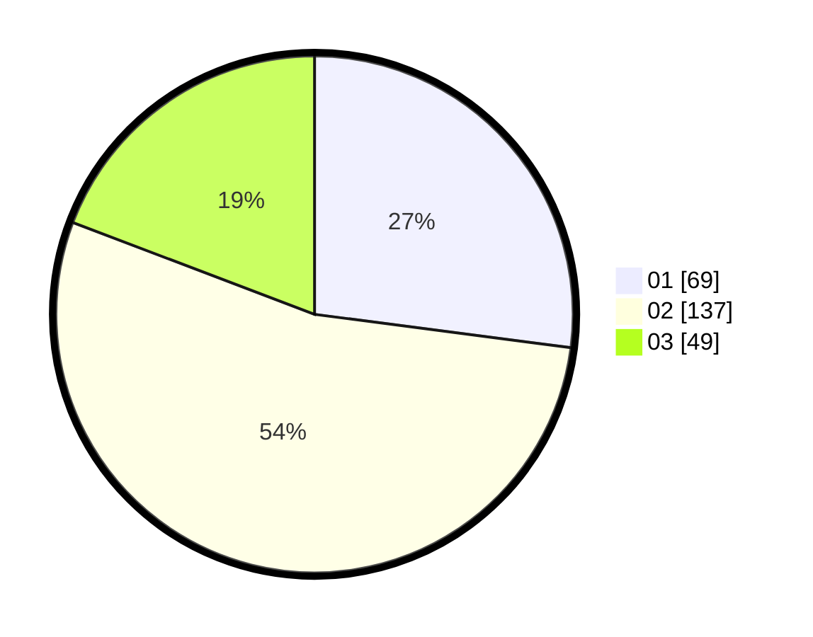

# Hasil

Hasil perolehan suara paslon dapat dilihat pada file paslon-01.txt, paslon-02.txt, dan paslon-03.txt.

Jika tidak ada, artinya data tersebut belum ada pada SIREKAP.

## Perolehan Suara

 * Paslon 01: **69**.
 * Paslon 02: **137**.
 * Paslon 03: **49**.

## Foto C Plano

https://sirekap-obj-formc.kpu.go.id/8507/pemilu/ppwp/31/73/01/10/03/3173011003027-20240216-140257--8ddde7f9-33b1-46b4-bb16-9ad9fa5cfc6a.jpg

https://sirekap-obj-formc.kpu.go.id/8507/pemilu/ppwp/31/73/01/10/03/3173011003027-20240216-140259--d93b3446-b15a-4371-9f14-0ff4bb2957cc.jpg

https://sirekap-obj-formc.kpu.go.id/8507/pemilu/ppwp/31/73/01/10/03/3173011003027-20240216-140258--6d35a506-c222-4eac-8beb-ccf1faaa3a79.jpg

## DATA PEMILIH TETAP

Jumlah pemilih dalam DPT: **254**.
 * L: **107**.
 * P: **147**.

## DATA PENGGUNA HAK PILIH

Jumlah pengguna hak pilih dalam DPT: **254**.
 * L: **107**.
 * P: **147**.

Jumlah pengguna hak pilih dalam DPTb: **5**.
 * L: **2**.
 * P: **3**.

Jumlah pengguna hak pilih dalam DPK: **2**.
 * L: **1**.
 * P: **1**.

Jumlah pengguna hak pilih: **261**.
 * L: **110**.
 * P: **151**.

## JUMLAH SUARA SAH DAN TIDAK SAH

JUMLAH SELURUH SUARA SAH: **255**.

JUMLAH SUARA TIDAK SAH: **6**.

JUMLAH SELURUH SUARA SAH DAN SUARA TIDAK SAH: **261**.
