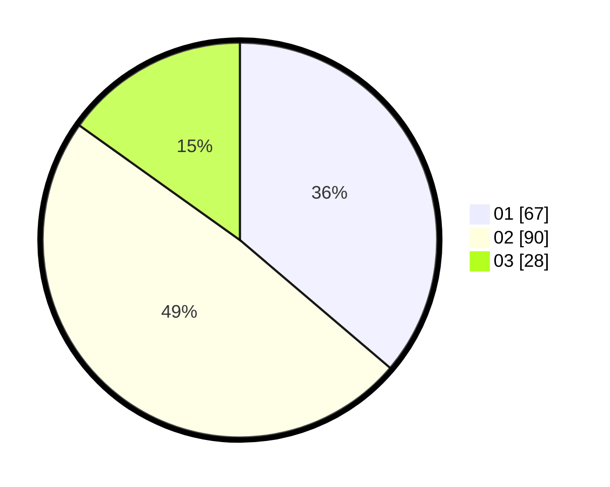

# Hasil

Hasil perolehan suara paslon dapat dilihat pada file paslon-01.txt, paslon-02.txt, dan paslon-03.txt.

Jika tidak ada, artinya data tersebut belum ada pada SIREKAP.

## Perolehan Suara

 * Paslon 01: **67**.
 * Paslon 02: **90**.
 * Paslon 03: **28**.

## Foto C Plano

https://sirekap-obj-formc.kpu.go.id/335c/pemilu/ppwp/31/73/01/10/03/3173011003028-20240216-143655--8ff1a23d-73f3-4362-8e95-89cd834b7e30.jpg

https://sirekap-obj-formc.kpu.go.id/335c/pemilu/ppwp/31/73/01/10/03/3173011003028-20240216-143656--b481c379-587f-40f2-a913-cc3ce9b12ca9.jpg

https://sirekap-obj-formc.kpu.go.id/335c/pemilu/ppwp/31/73/01/10/03/3173011003028-20240216-143656--0701537d-6e5b-4c66-8253-ea641ff0a0c2.jpg

## DATA PEMILIH TETAP

Jumlah pemilih dalam DPT: **279**.
 * L: **149**.
 * P: **130**.

## DATA PENGGUNA HAK PILIH

Jumlah pengguna hak pilih dalam DPT: **183**.
 * L: **89**.
 * P: **94**.

Jumlah pengguna hak pilih dalam DPTb: **2**.
 * L: **1**.
 * P: **1**.

Jumlah pengguna hak pilih dalam DPK: **1**.
 * L: **0**.
 * P: **1**.

Jumlah pengguna hak pilih: **186**.
 * L: **90**.
 * P: **96**.

## JUMLAH SUARA SAH DAN TIDAK SAH

JUMLAH SELURUH SUARA SAH: **185**.

JUMLAH SUARA TIDAK SAH: **1**.

JUMLAH SELURUH SUARA SAH DAN SUARA TIDAK SAH: **186**.
