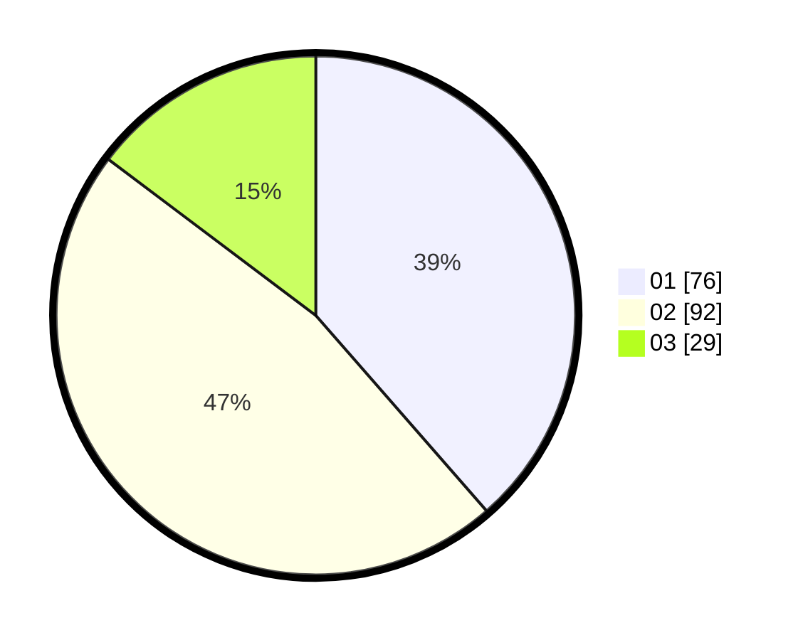

# Hasil

Hasil perolehan suara paslon dapat dilihat pada file paslon-01.txt, paslon-02.txt, dan paslon-03.txt.

Jika tidak ada, artinya data tersebut belum ada pada SIREKAP.

## Perolehan Suara

 * Paslon 01: **76**.
 * Paslon 02: **92**.
 * Paslon 03: **29**.

## Foto C Plano

https://sirekap-obj-formc.kpu.go.id/f813/pemilu/ppwp/31/73/01/10/03/3173011003030-20240214-192928--e12736fb-c1a5-439c-9810-6dc3b9bd1802.jpg

https://sirekap-obj-formc.kpu.go.id/f813/pemilu/ppwp/31/73/01/10/03/3173011003030-20240214-193104--12c26c8d-96ea-4b15-a7fc-a9e8880919cf.jpg

https://sirekap-obj-formc.kpu.go.id/f813/pemilu/ppwp/31/73/01/10/03/3173011003030-20240214-193204--fd5be0de-75d9-414a-b221-214ee653df88.jpg

## DATA PEMILIH TETAP

Jumlah pemilih dalam DPT: **286**.
 * L: **142**.
 * P: **144**.

## DATA PENGGUNA HAK PILIH

Jumlah pengguna hak pilih dalam DPT: **286**.
 * L: **142**.
 * P: **144**.

Jumlah pengguna hak pilih dalam DPTb: **0**.
 * L: **0**.
 * P: **0**.

Jumlah pengguna hak pilih dalam DPK: **0**.
 * L: **0**.
 * P: **0**.

Jumlah pengguna hak pilih: **286**.
 * L: **142**.
 * P: **144**.

## JUMLAH SUARA SAH DAN TIDAK SAH

JUMLAH SELURUH SUARA SAH: **197**.

JUMLAH SUARA TIDAK SAH: **3**.

JUMLAH SELURUH SUARA SAH DAN SUARA TIDAK SAH: **200**.
