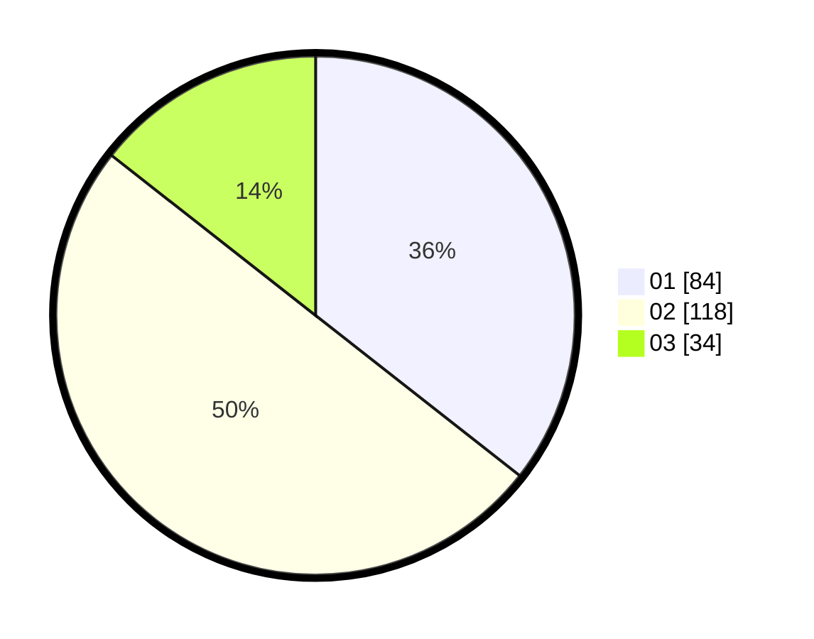

# Hasil

Hasil perolehan suara paslon dapat dilihat pada file paslon-01.txt, paslon-02.txt, dan paslon-03.txt.

Jika tidak ada, artinya data tersebut belum ada pada SIREKAP.

## Perolehan Suara

 * Paslon 01: **84**.
 * Paslon 02: **118**.
 * Paslon 03: **34**.

## Foto C Plano

https://sirekap-obj-formc.kpu.go.id/2435/pemilu/ppwp/31/73/01/10/03/3173011003043-20240216-061609--b74f8f71-947c-4232-a308-cd2e8dc8b8b0.jpg

https://sirekap-obj-formc.kpu.go.id/2435/pemilu/ppwp/31/73/01/10/03/3173011003043-20240216-015001--dc39d1aa-8120-4176-a4f4-661dd5e778f6.jpg

https://sirekap-obj-formc.kpu.go.id/2435/pemilu/ppwp/31/73/01/10/03/3173011003043-20240216-014951--2c05a747-2a9c-46bf-9ffc-4b66ba24a3b3.jpg

## DATA PEMILIH TETAP

Jumlah pemilih dalam DPT: **292**.
 * L: **144**.
 * P: **148**.

## DATA PENGGUNA HAK PILIH

Jumlah pengguna hak pilih dalam DPT: **240**.
 * L: **119**.
 * P: **121**.

Jumlah pengguna hak pilih dalam DPTb: **1**.
 * L: **0**.
 * P: **1**.

Jumlah pengguna hak pilih dalam DPK: **1**.
 * L: **0**.
 * P: **1**.

Jumlah pengguna hak pilih: **242**.
 * L: **119**.
 * P: **123**.

## JUMLAH SUARA SAH DAN TIDAK SAH

JUMLAH SELURUH SUARA SAH: **236**.

JUMLAH SUARA TIDAK SAH: **6**.

JUMLAH SELURUH SUARA SAH DAN SUARA TIDAK SAH: **242**.
