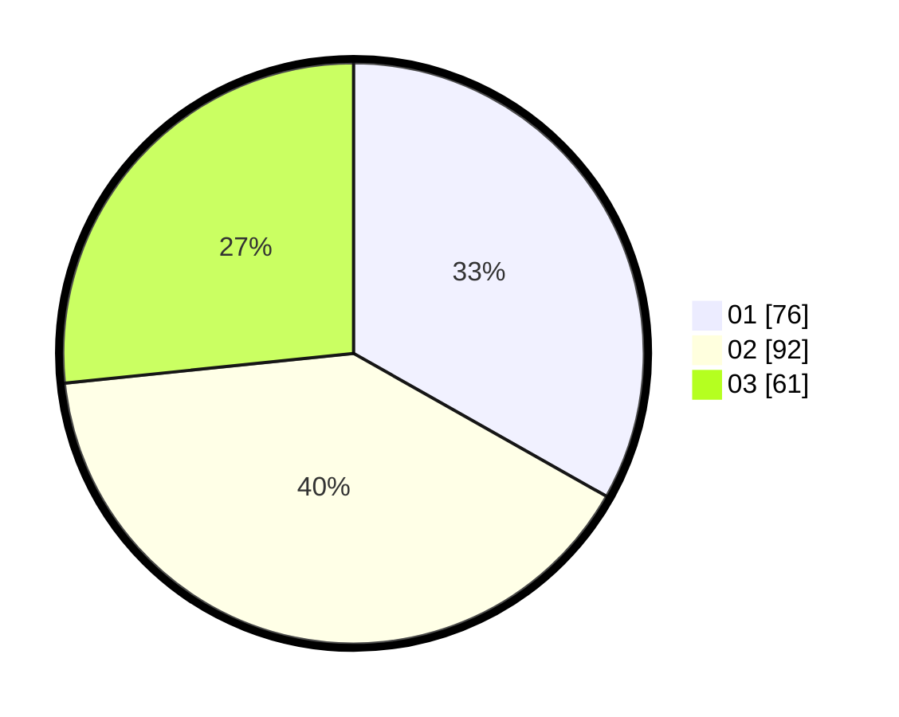

# Hasil

Hasil perolehan suara paslon dapat dilihat pada file paslon-01.txt, paslon-02.txt, dan paslon-03.txt.

Jika tidak ada, artinya data tersebut belum ada pada SIREKAP.

## Perolehan Suara

 * Paslon 01: **76**.
 * Paslon 02: **92**.
 * Paslon 03: **61**.

## Foto C Plano

https://sirekap-obj-formc.kpu.go.id/5683/pemilu/ppwp/31/73/01/10/03/3173011003047-20240216-120544--e9879e70-653c-45d6-9ba9-1c4bf06fbb1f.jpg

https://sirekap-obj-formc.kpu.go.id/5683/pemilu/ppwp/31/73/01/10/03/3173011003047-20240216-120549--6b3861dc-4bf8-42bc-990c-a182cb2ab4ab.jpg

https://sirekap-obj-formc.kpu.go.id/5683/pemilu/ppwp/31/73/01/10/03/3173011003047-20240216-120545--2803d9a2-c241-4feb-8e94-876f88fc7de2.jpg

## DATA PEMILIH TETAP

Jumlah pemilih dalam DPT: **291**.
 * L: **145**.
 * P: **146**.

## DATA PENGGUNA HAK PILIH

Jumlah pengguna hak pilih dalam DPT: **226**.
 * L: **104**.
 * P: **122**.

Jumlah pengguna hak pilih dalam DPTb: **0**.
 * L: **0**.
 * P: **0**.

Jumlah pengguna hak pilih dalam DPK: **3**.
 * L: **2**.
 * P: **1**.

Jumlah pengguna hak pilih: **229**.
 * L: **106**.
 * P: **123**.

## JUMLAH SUARA SAH DAN TIDAK SAH

JUMLAH SELURUH SUARA SAH: **229**.

JUMLAH SUARA TIDAK SAH: **0**.

JUMLAH SELURUH SUARA SAH DAN SUARA TIDAK SAH: **229**.
