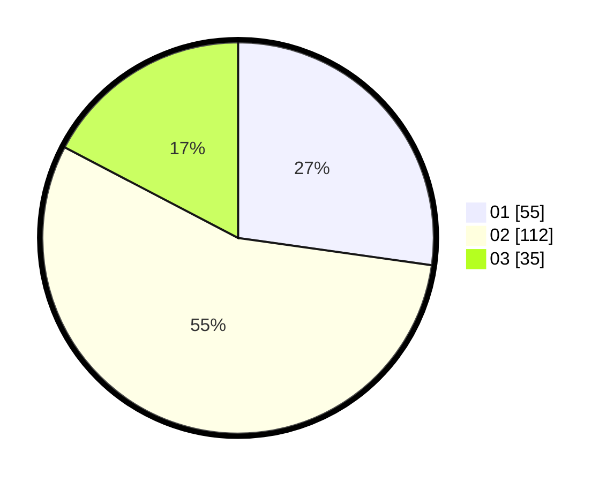

# Hasil

Hasil perolehan suara paslon dapat dilihat pada file paslon-01.txt, paslon-02.txt, dan paslon-03.txt.

Jika tidak ada, artinya data tersebut belum ada pada SIREKAP.

## Perolehan Suara

 * Paslon 01: **55**.
 * Paslon 02: **112**.
 * Paslon 03: **35**.

## Foto C Plano

https://sirekap-obj-formc.kpu.go.id/53fe/pemilu/ppwp/31/73/01/10/03/3173011003048-20240219-074547--39ea38eb-58fb-43ce-ad4c-b5a40eca1cd3.jpg

https://sirekap-obj-formc.kpu.go.id/53fe/pemilu/ppwp/31/73/01/10/03/3173011003048-20240219-081654--4e4a4cb1-d934-4748-9689-9eb06d90ef5d.jpg

https://sirekap-obj-formc.kpu.go.id/53fe/pemilu/ppwp/31/73/01/10/03/3173011003048-20240219-081901--22122b30-9f1f-4dfa-ae61-ce5c12080502.jpg

## DATA PEMILIH TETAP

Jumlah pemilih dalam DPT: **286**.
 * L: **148**.
 * P: **138**.

## DATA PENGGUNA HAK PILIH

Jumlah pengguna hak pilih dalam DPT: **199**.
 * L: **100**.
 * P: **99**.

Jumlah pengguna hak pilih dalam DPTb: **0**.
 * L: **0**.
 * P: **0**.

Jumlah pengguna hak pilih dalam DPK: **3**.
 * L: **2**.
 * P: **1**.

Jumlah pengguna hak pilih: **202**.
 * L: **102**.
 * P: **100**.

## JUMLAH SUARA SAH DAN TIDAK SAH

JUMLAH SELURUH SUARA SAH: **202**.

JUMLAH SUARA TIDAK SAH: **0**.

JUMLAH SELURUH SUARA SAH DAN SUARA TIDAK SAH: **202**.
