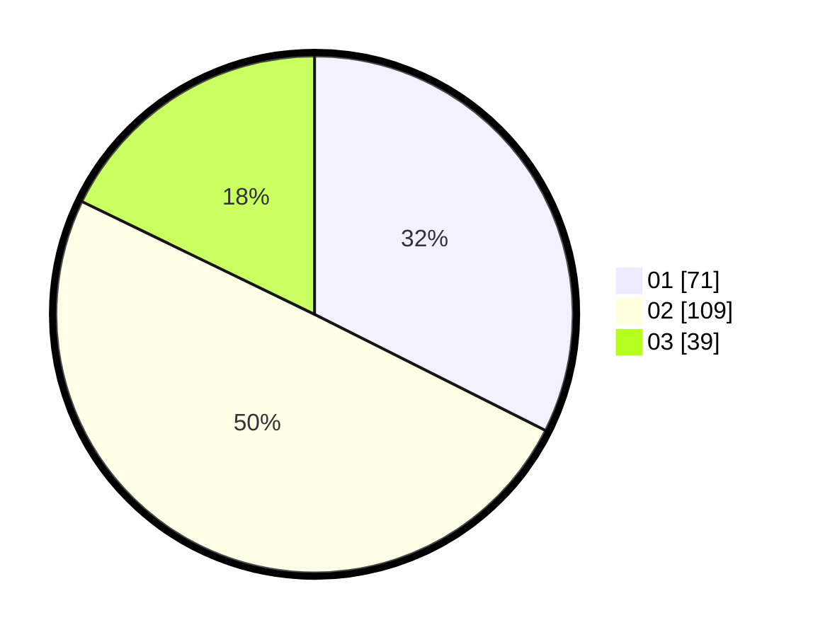

# Hasil

Hasil perolehan suara paslon dapat dilihat pada file paslon-01.txt, paslon-02.txt, dan paslon-03.txt.

Jika tidak ada, artinya data tersebut belum ada pada SIREKAP.

## Perolehan Suara

 * Paslon 01: **71**.
 * Paslon 02: **109**.
 * Paslon 03: **39**.

## Foto C Plano

https://sirekap-obj-formc.kpu.go.id/3800/pemilu/ppwp/31/73/01/10/03/3173011003049-20240216-033044--38f2ef2c-422d-4231-9053-cef29ba3d229.jpg

https://sirekap-obj-formc.kpu.go.id/3800/pemilu/ppwp/31/73/01/10/03/3173011003049-20240216-033046--fc7b34fd-08b0-437f-ae9d-332751ed2753.jpg

https://sirekap-obj-formc.kpu.go.id/3800/pemilu/ppwp/31/73/01/10/03/3173011003049-20240216-033045--910efe69-1049-44ba-98ed-0263b27c76c9.jpg

## DATA PEMILIH TETAP

Jumlah pemilih dalam DPT: **290**.
 * L: **144**.
 * P: **146**.

## DATA PENGGUNA HAK PILIH

Jumlah pengguna hak pilih dalam DPT: **219**.
 * L: **103**.
 * P: **116**.

Jumlah pengguna hak pilih dalam DPTb: **2**.
 * L: **1**.
 * P: **1**.

Jumlah pengguna hak pilih dalam DPK: **1**.
 * L: **1**.
 * P: **0**.

Jumlah pengguna hak pilih: **222**.
 * L: **105**.
 * P: **117**.

## JUMLAH SUARA SAH DAN TIDAK SAH

JUMLAH SELURUH SUARA SAH: **219**.

JUMLAH SUARA TIDAK SAH: **3**.

JUMLAH SELURUH SUARA SAH DAN SUARA TIDAK SAH: **222**.
