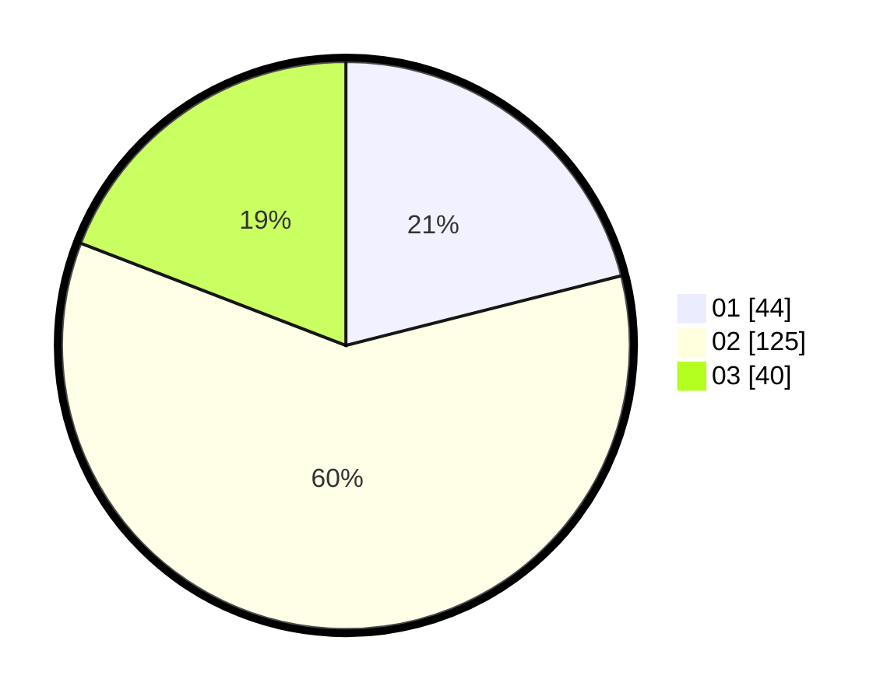

# Hasil

Hasil perolehan suara paslon dapat dilihat pada file paslon-01.txt, paslon-02.txt, dan paslon-03.txt.

Jika tidak ada, artinya data tersebut belum ada pada SIREKAP.

## Perolehan Suara

 * Paslon 01: **44**.
 * Paslon 02: **125**.
 * Paslon 03: **40**.

## Foto C Plano

https://sirekap-obj-formc.kpu.go.id/a334/pemilu/ppwp/31/73/01/10/03/3173011003052-20240217-164144--06d609a1-ebb8-46bf-b966-509e303b6f9d.jpg

https://sirekap-obj-formc.kpu.go.id/a334/pemilu/ppwp/31/73/01/10/03/3173011003052-20240217-164146--9d4aaf9b-796b-4963-aca2-689d73cb7840.jpg

https://sirekap-obj-formc.kpu.go.id/a334/pemilu/ppwp/31/73/01/10/03/3173011003052-20240217-164145--7667ef61-8047-4e9a-9451-3e6dcf7110b9.jpg

## DATA PEMILIH TETAP

Jumlah pemilih dalam DPT: **207**.
 * L: **91**.
 * P: **116**.

## DATA PENGGUNA HAK PILIH

Jumlah pengguna hak pilih dalam DPT: **207**.
 * L: **91**.
 * P: **116**.

Jumlah pengguna hak pilih dalam DPTb: **2**.
 * L: **2**.
 * P: **0**.

Jumlah pengguna hak pilih dalam DPK: **0**.
 * L: **0**.
 * P: **0**.

Jumlah pengguna hak pilih: **209**.
 * L: **93**.
 * P: **116**.

## JUMLAH SUARA SAH DAN TIDAK SAH

JUMLAH SELURUH SUARA SAH: **0**.

JUMLAH SUARA TIDAK SAH: **0**.

JUMLAH SELURUH SUARA SAH DAN SUARA TIDAK SAH: **0**.
