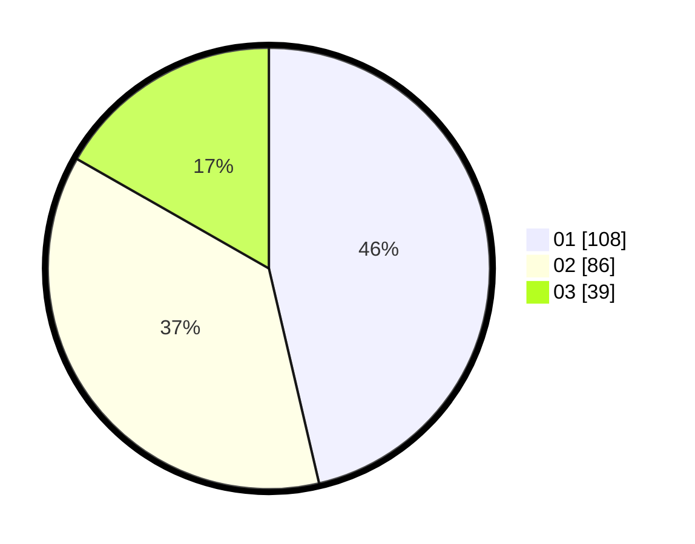

# Hasil

Hasil perolehan suara paslon dapat dilihat pada file paslon-01.txt, paslon-02.txt, dan paslon-03.txt.

Jika tidak ada, artinya data tersebut belum ada pada SIREKAP.

## Perolehan Suara

 * Paslon 01: **108**.
 * Paslon 02: **86**.
 * Paslon 03: **39**.

## Foto C Plano

https://sirekap-obj-formc.kpu.go.id/2ef2/pemilu/ppwp/31/73/01/10/03/3173011003055-20240216-044120--c8f518ac-b820-4578-b353-e1de4a074720.jpg

https://sirekap-obj-formc.kpu.go.id/2ef2/pemilu/ppwp/31/73/01/10/03/3173011003055-20240216-044124--27cc7868-508a-4dd2-b6d3-dfe7989269fe.jpg

https://sirekap-obj-formc.kpu.go.id/2ef2/pemilu/ppwp/31/73/01/10/03/3173011003055-20240216-044123--a5b836cc-b155-4bf7-b324-d21be014e6ae.jpg

## DATA PEMILIH TETAP

Jumlah pemilih dalam DPT: **290**.
 * L: **144**.
 * P: **146**.

## DATA PENGGUNA HAK PILIH

Jumlah pengguna hak pilih dalam DPT: **232**.
 * L: **109**.
 * P: **123**.

Jumlah pengguna hak pilih dalam DPTb: **0**.
 * L: **0**.
 * P: **0**.

Jumlah pengguna hak pilih dalam DPK: **5**.
 * L: **2**.
 * P: **3**.

Jumlah pengguna hak pilih: **237**.
 * L: **111**.
 * P: **126**.

## JUMLAH SUARA SAH DAN TIDAK SAH

JUMLAH SELURUH SUARA SAH: **233**.

JUMLAH SUARA TIDAK SAH: **4**.

JUMLAH SELURUH SUARA SAH DAN SUARA TIDAK SAH: **237**.
