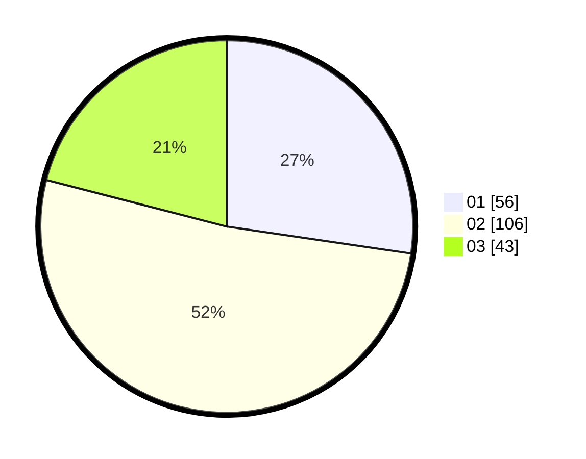

# Hasil

Hasil perolehan suara paslon dapat dilihat pada file paslon-01.txt, paslon-02.txt, dan paslon-03.txt.

Jika tidak ada, artinya data tersebut belum ada pada SIREKAP.

## Perolehan Suara

 * Paslon 01: **56**.
 * Paslon 02: **106**.
 * Paslon 03: **43**.

## Foto C Plano

https://sirekap-obj-formc.kpu.go.id/68e5/pemilu/ppwp/31/73/01/10/03/3173011003057-20240214-222732--030e44e9-019d-48b2-aecf-e2cdad1b9e2a.jpg

https://sirekap-obj-formc.kpu.go.id/68e5/pemilu/ppwp/31/73/01/10/03/3173011003057-20240214-222951--9a050036-72ca-4ff3-9eaa-4be03e922a7e.jpg

https://sirekap-obj-formc.kpu.go.id/68e5/pemilu/ppwp/31/73/01/10/03/3173011003057-20240214-223159--65af70b0-dcf8-4a1a-86b6-5129cf5a31b3.jpg

## DATA PEMILIH TETAP

Jumlah pemilih dalam DPT: **284**.
 * L: **150**.
 * P: **134**.

## DATA PENGGUNA HAK PILIH

Jumlah pengguna hak pilih dalam DPT: **203**.
 * L: **105**.
 * P: **98**.

Jumlah pengguna hak pilih dalam DPTb: **0**.
 * L: **0**.
 * P: **0**.

Jumlah pengguna hak pilih dalam DPK: **4**.
 * L: **2**.
 * P: **2**.

Jumlah pengguna hak pilih: **207**.
 * L: **107**.
 * P: **100**.

## JUMLAH SUARA SAH DAN TIDAK SAH

JUMLAH SELURUH SUARA SAH: **205**.

JUMLAH SUARA TIDAK SAH: **2**.

JUMLAH SELURUH SUARA SAH DAN SUARA TIDAK SAH: **207**.
