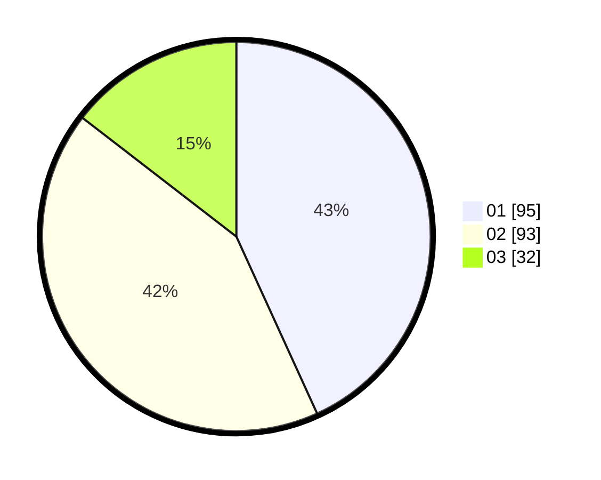

# Hasil

Hasil perolehan suara paslon dapat dilihat pada file paslon-01.txt, paslon-02.txt, dan paslon-03.txt.

Jika tidak ada, artinya data tersebut belum ada pada SIREKAP.

## Perolehan Suara

 * Paslon 01: **95**.
 * Paslon 02: **93**.
 * Paslon 03: **32**.

## Foto C Plano

https://sirekap-obj-formc.kpu.go.id/b7d8/pemilu/ppwp/31/73/01/10/03/3173011003061-20240214-155701--797121cc-9b3e-443a-8f09-5150b8e156a6.jpg

https://sirekap-obj-formc.kpu.go.id/b7d8/pemilu/ppwp/31/73/01/10/03/3173011003061-20240214-190018--9e0fefc2-e1d0-419c-b048-fa632affcb73.jpg

https://sirekap-obj-formc.kpu.go.id/b7d8/pemilu/ppwp/31/73/01/10/03/3173011003061-20240214-185936--c603dbcf-37f9-4a4a-ae0d-3eabf7f1d33b.jpg

## DATA PEMILIH TETAP

Jumlah pemilih dalam DPT: **272**.
 * L: **135**.
 * P: **137**.

## DATA PENGGUNA HAK PILIH

Jumlah pengguna hak pilih dalam DPT: **202**.
 * L: **96**.
 * P: **106**.

Jumlah pengguna hak pilih dalam DPTb: **8**.
 * L: **3**.
 * P: **5**.

Jumlah pengguna hak pilih dalam DPK: **15**.
 * L: **7**.
 * P: **8**.

Jumlah pengguna hak pilih: **225**.
 * L: **106**.
 * P: **119**.

## JUMLAH SUARA SAH DAN TIDAK SAH

JUMLAH SELURUH SUARA SAH: **204**.

JUMLAH SUARA TIDAK SAH: **5**.

JUMLAH SELURUH SUARA SAH DAN SUARA TIDAK SAH: **225**.
