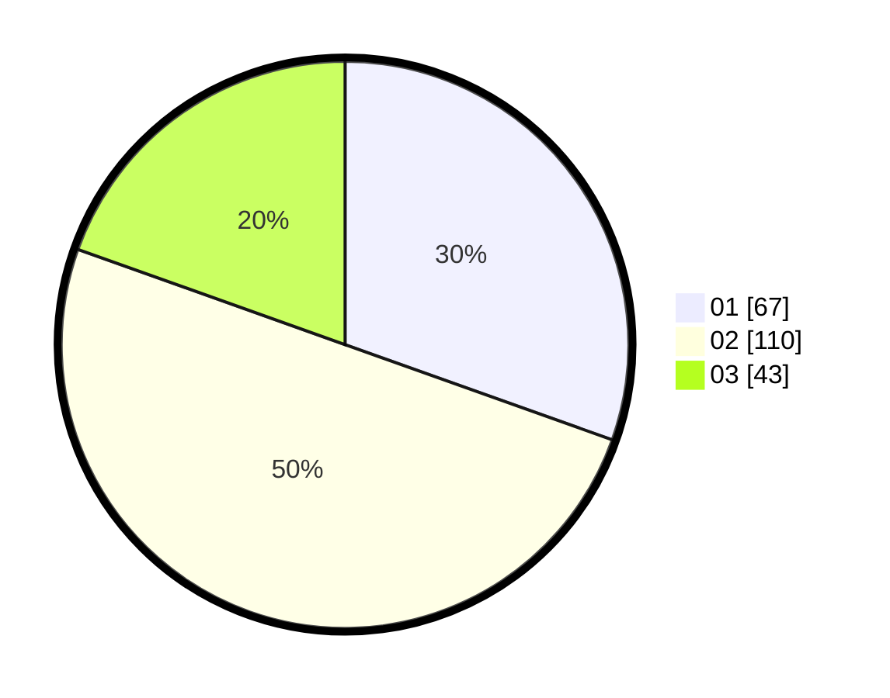

# Hasil

Hasil perolehan suara paslon dapat dilihat pada file paslon-01.txt, paslon-02.txt, dan paslon-03.txt.

Jika tidak ada, artinya data tersebut belum ada pada SIREKAP.

## Perolehan Suara

 * Paslon 01: **67**.
 * Paslon 02: **110**.
 * Paslon 03: **43**.

## Foto C Plano

https://sirekap-obj-formc.kpu.go.id/53b8/pemilu/ppwp/31/73/01/10/03/3173011003063-20240215-004236--44bf5399-e9f3-40e8-bba9-815475b8875c.jpg

https://sirekap-obj-formc.kpu.go.id/53b8/pemilu/ppwp/31/73/01/10/03/3173011003063-20240216-111356--192d8fed-81dc-4882-bb27-20c2cd449819.jpg

https://sirekap-obj-formc.kpu.go.id/53b8/pemilu/ppwp/31/73/01/10/03/3173011003063-20240216-111355--6827b835-45b7-4a1c-89ee-b03f212a17b2.jpg

## DATA PEMILIH TETAP

Jumlah pemilih dalam DPT: **268**.
 * L: **130**.
 * P: **138**.

## DATA PENGGUNA HAK PILIH

Jumlah pengguna hak pilih dalam DPT: **206**.
 * L: **98**.
 * P: **108**.

Jumlah pengguna hak pilih dalam DPTb: **10**.
 * L: **3**.
 * P: **7**.

Jumlah pengguna hak pilih dalam DPK: **5**.
 * L: **2**.
 * P: **3**.

Jumlah pengguna hak pilih: **221**.
 * L: **103**.
 * P: **118**.

## JUMLAH SUARA SAH DAN TIDAK SAH

JUMLAH SELURUH SUARA SAH: **220**.

JUMLAH SUARA TIDAK SAH: **1**.

JUMLAH SELURUH SUARA SAH DAN SUARA TIDAK SAH: **221**.
