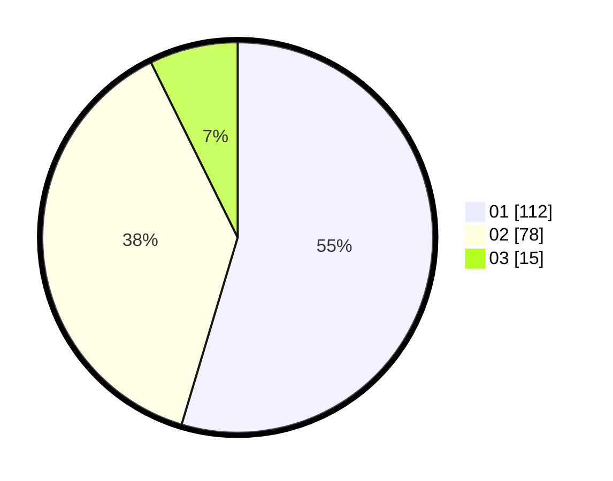

# Hasil

Hasil perolehan suara paslon dapat dilihat pada file paslon-01.txt, paslon-02.txt, dan paslon-03.txt.

Jika tidak ada, artinya data tersebut belum ada pada SIREKAP.

## Perolehan Suara

 * Paslon 01: **112**.
 * Paslon 02: **78**.
 * Paslon 03: **15**.

## Foto C Plano

https://sirekap-obj-formc.kpu.go.id/2f33/pemilu/ppwp/31/73/01/10/03/3173011003068-20240216-022515--ff5d158d-358c-417f-825c-1a6e705ecc5c.jpg

https://sirekap-obj-formc.kpu.go.id/2f33/pemilu/ppwp/31/73/01/10/03/3173011003068-20240216-022536--aba89c2a-8c1f-47dd-9554-f5572d6b8310.jpg

https://sirekap-obj-formc.kpu.go.id/2f33/pemilu/ppwp/31/73/01/10/03/3173011003068-20240216-020343--86e2459a-f1b2-4205-9b1e-abd9c615d1d9.jpg

## DATA PEMILIH TETAP

Jumlah pemilih dalam DPT: **271**.
 * L: **140**.
 * P: **131**.

## DATA PENGGUNA HAK PILIH

Jumlah pengguna hak pilih dalam DPT: **205**.
 * L: **104**.
 * P: **101**.

Jumlah pengguna hak pilih dalam DPTb: **0**.
 * L: **0**.
 * P: **0**.

Jumlah pengguna hak pilih dalam DPK: **4**.
 * L: **2**.
 * P: **2**.

Jumlah pengguna hak pilih: **209**.
 * L: **106**.
 * P: **103**.

## JUMLAH SUARA SAH DAN TIDAK SAH

JUMLAH SELURUH SUARA SAH: **205**.

JUMLAH SUARA TIDAK SAH: **4**.

JUMLAH SELURUH SUARA SAH DAN SUARA TIDAK SAH: **209**.
