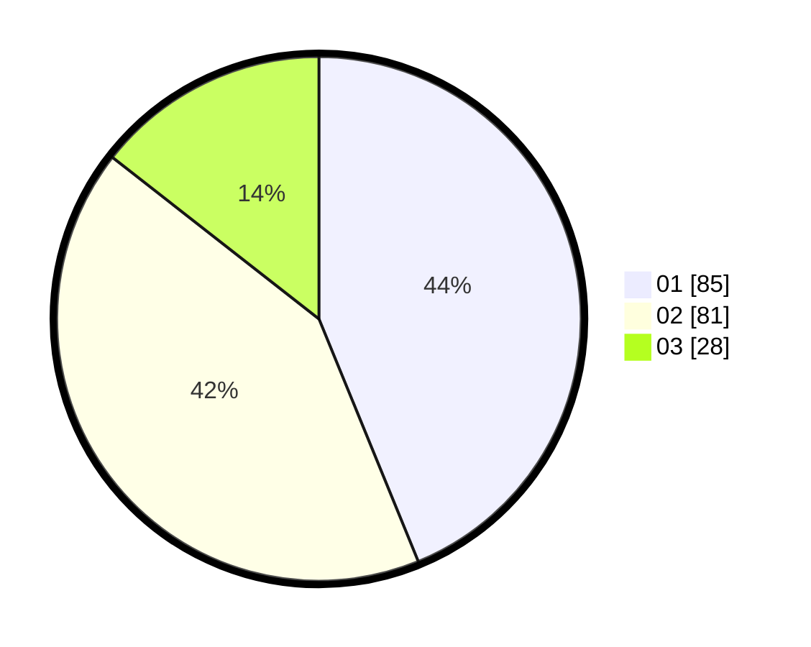

# Hasil

Hasil perolehan suara paslon dapat dilihat pada file paslon-01.txt, paslon-02.txt, dan paslon-03.txt.

Jika tidak ada, artinya data tersebut belum ada pada SIREKAP.

## Perolehan Suara

 * Paslon 01: **85**.
 * Paslon 02: **81**.
 * Paslon 03: **28**.

## Foto C Plano

https://sirekap-obj-formc.kpu.go.id/8ce3/pemilu/ppwp/31/73/01/10/03/3173011003071-20240215-000029--b68cd677-61f7-4bff-a4a1-b7a2ffcdfe10.jpg

https://sirekap-obj-formc.kpu.go.id/8ce3/pemilu/ppwp/31/73/01/10/03/3173011003071-20240214-235832--85c7c197-a3c0-49df-862f-ace13a29e8c9.jpg
