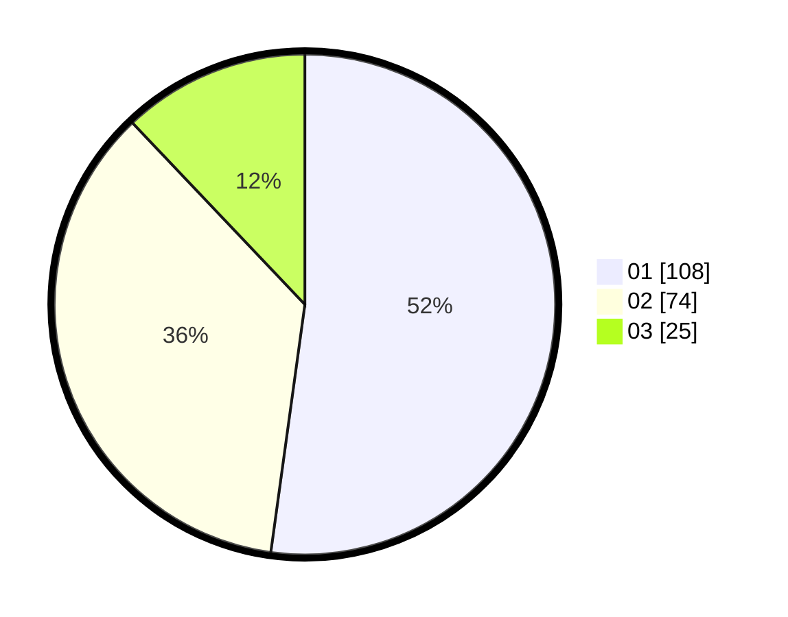

# Hasil

Hasil perolehan suara paslon dapat dilihat pada file paslon-01.txt, paslon-02.txt, dan paslon-03.txt.

Jika tidak ada, artinya data tersebut belum ada pada SIREKAP.

## Perolehan Suara

 * Paslon 01: **108**.
 * Paslon 02: **74**.
 * Paslon 03: **25**.

## Foto C Plano

https://sirekap-obj-formc.kpu.go.id/00f5/pemilu/ppwp/31/73/01/10/03/3173011003073-20240216-091051--922feddf-ee53-495d-9551-6127c0a0a258.jpg

https://sirekap-obj-formc.kpu.go.id/00f5/pemilu/ppwp/31/73/01/10/03/3173011003073-20240216-091052--d0af84a0-f586-4b28-a2e0-0144691605dc.jpg

https://sirekap-obj-formc.kpu.go.id/00f5/pemilu/ppwp/31/73/01/10/03/3173011003073-20240216-091052--dcd979dd-9492-44d8-a12b-0460ecb1676e.jpg

## DATA PEMILIH TETAP

Jumlah pemilih dalam DPT: **256**.
 * L: **127**.
 * P: **129**.

## DATA PENGGUNA HAK PILIH

Jumlah pengguna hak pilih dalam DPT: **212**.
 * L: **102**.
 * P: **110**.

Jumlah pengguna hak pilih dalam DPTb: **0**.
 * L: **0**.
 * P: **0**.

Jumlah pengguna hak pilih dalam DPK: **3**.
 * L: **0**.
 * P: **3**.

Jumlah pengguna hak pilih: **215**.
 * L: **102**.
 * P: **113**.

## JUMLAH SUARA SAH DAN TIDAK SAH

JUMLAH SELURUH SUARA SAH: **211**.

JUMLAH SUARA TIDAK SAH: **4**.

JUMLAH SELURUH SUARA SAH DAN SUARA TIDAK SAH: **215**.
