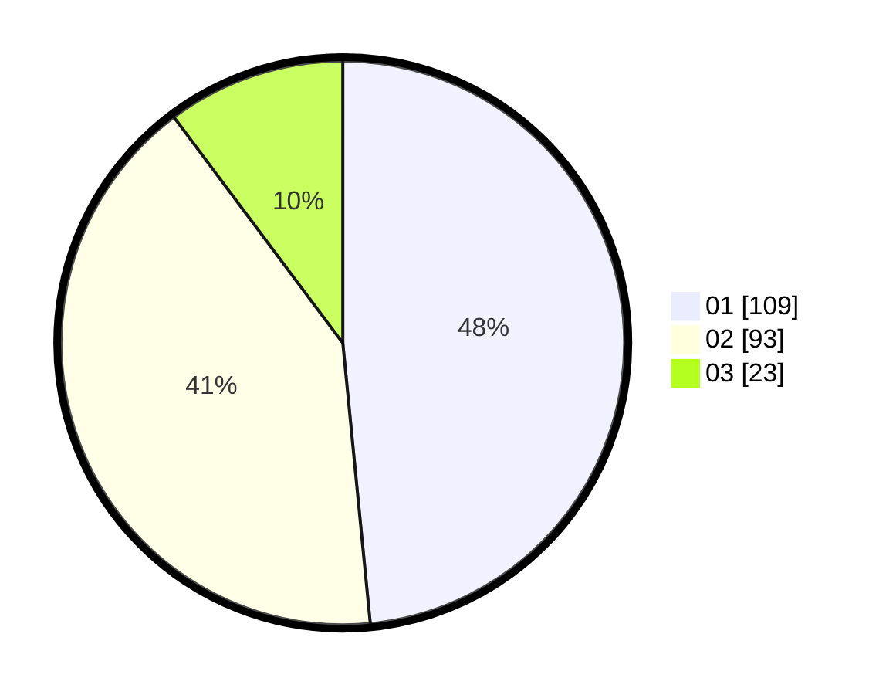

# Hasil

Hasil perolehan suara paslon dapat dilihat pada file paslon-01.txt, paslon-02.txt, dan paslon-03.txt.

Jika tidak ada, artinya data tersebut belum ada pada SIREKAP.

## Perolehan Suara

 * Paslon 01: **109**.
 * Paslon 02: **93**.
 * Paslon 03: **23**.

## Foto C Plano

https://sirekap-obj-formc.kpu.go.id/7fe4/pemilu/ppwp/31/73/01/10/03/3173011003074-20240214-192211--43f68d83-17c9-42cd-94fa-48cc7b53f7cf.jpg

https://sirekap-obj-formc.kpu.go.id/7fe4/pemilu/ppwp/31/73/01/10/03/3173011003074-20240214-192617--6c5ae5db-2c40-476a-a0b0-142ca37383c3.jpg

https://sirekap-obj-formc.kpu.go.id/7fe4/pemilu/ppwp/31/73/01/10/03/3173011003074-20240214-192457--0d12e0ac-e305-4337-81a4-9ca58f3ce02e.jpg

## DATA PEMILIH TETAP

Jumlah pemilih dalam DPT: **267**.
 * L: **133**.
 * P: **134**.

## DATA PENGGUNA HAK PILIH

Jumlah pengguna hak pilih dalam DPT: **221**.
 * L: **107**.
 * P: **114**.

Jumlah pengguna hak pilih dalam DPTb: **0**.
 * L: **0**.
 * P: **0**.

Jumlah pengguna hak pilih dalam DPK: **9**.
 * L: **4**.
 * P: **5**.

Jumlah pengguna hak pilih: **230**.
 * L: **111**.
 * P: **119**.

## JUMLAH SUARA SAH DAN TIDAK SAH

JUMLAH SELURUH SUARA SAH: **225**.

JUMLAH SUARA TIDAK SAH: **5**.

JUMLAH SELURUH SUARA SAH DAN SUARA TIDAK SAH: **230**.
