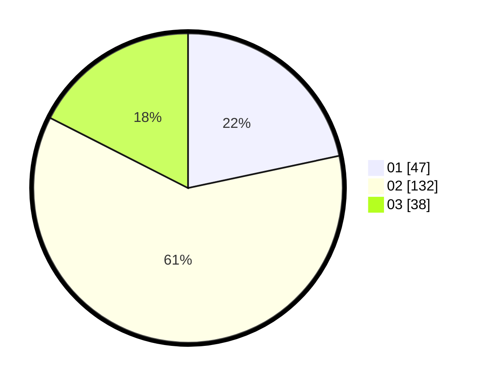

# Hasil

Hasil perolehan suara paslon dapat dilihat pada file paslon-01.txt, paslon-02.txt, dan paslon-03.txt.

Jika tidak ada, artinya data tersebut belum ada pada SIREKAP.

## Perolehan Suara

 * Paslon 01: **47**.
 * Paslon 02: **132**.
 * Paslon 03: **38**.

## Foto C Plano

https://sirekap-obj-formc.kpu.go.id/9cc1/pemilu/ppwp/31/73/01/10/03/3173011003078-20240215-005420--7931b037-5776-45aa-aa3a-95073d65141b.jpg

https://sirekap-obj-formc.kpu.go.id/9cc1/pemilu/ppwp/31/73/01/10/03/3173011003078-20240215-005100--03dd273c-1548-4ec6-bc8b-76a40ff07d72.jpg

https://sirekap-obj-formc.kpu.go.id/9cc1/pemilu/ppwp/31/73/01/10/03/3173011003078-20240215-005136--43c06176-2f95-420f-b0b1-54ba453b39c9.jpg

## DATA PEMILIH TETAP

Jumlah pemilih dalam DPT: **271**.
 * L: **141**.
 * P: **130**.

## DATA PENGGUNA HAK PILIH

Jumlah pengguna hak pilih dalam DPT: **215**.
 * L: **107**.
 * P: **108**.

Jumlah pengguna hak pilih dalam DPTb: **4**.
 * L: **4**.
 * P: **0**.

Jumlah pengguna hak pilih dalam DPK: **2**.
 * L: **1**.
 * P: **1**.

Jumlah pengguna hak pilih: **221**.
 * L: **112**.
 * P: **109**.

## JUMLAH SUARA SAH DAN TIDAK SAH

JUMLAH SELURUH SUARA SAH: **217**.

JUMLAH SUARA TIDAK SAH: **4**.

JUMLAH SELURUH SUARA SAH DAN SUARA TIDAK SAH: **221**.
