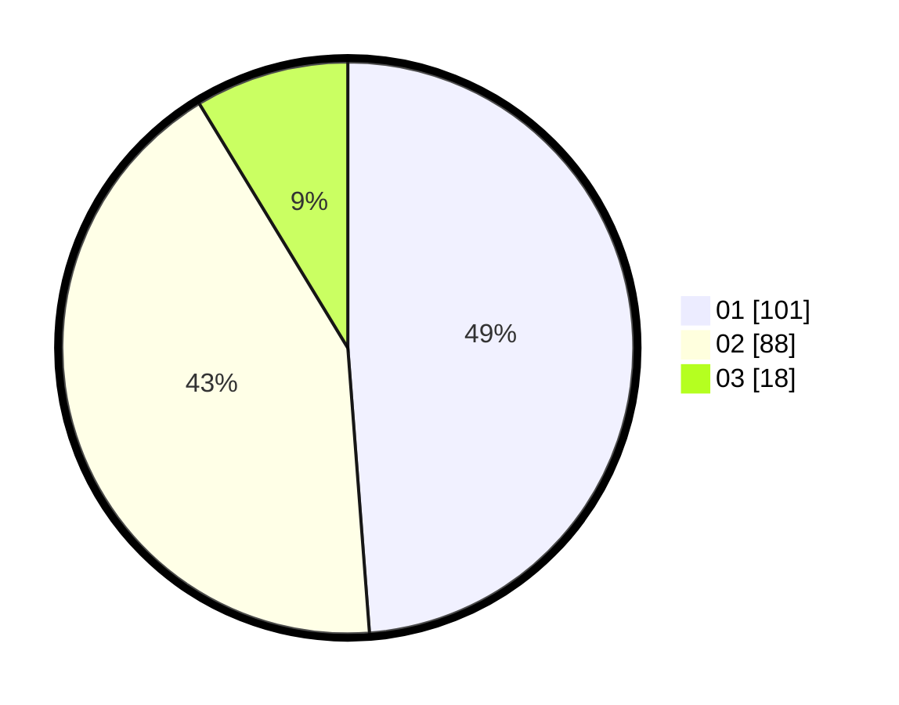

# Hasil

Hasil perolehan suara paslon dapat dilihat pada file paslon-01.txt, paslon-02.txt, dan paslon-03.txt.

Jika tidak ada, artinya data tersebut belum ada pada SIREKAP.

## Perolehan Suara

 * Paslon 01: **101**.
 * Paslon 02: **88**.
 * Paslon 03: **18**.

## Foto C Plano

https://sirekap-obj-formc.kpu.go.id/b74c/pemilu/ppwp/31/73/01/10/03/3173011003080-20240216-141635--f15cd201-177d-4ce0-91fa-b44db3bb9a1a.jpg

https://sirekap-obj-formc.kpu.go.id/b74c/pemilu/ppwp/31/73/01/10/03/3173011003080-20240216-141637--c79d7f41-f7f7-4a7c-a8fb-0060bf3d8fc8.jpg

https://sirekap-obj-formc.kpu.go.id/b74c/pemilu/ppwp/31/73/01/10/03/3173011003080-20240216-141636--daa4c0a6-daba-49b0-9aa7-cbeaaf64d9b7.jpg

## DATA PEMILIH TETAP

Jumlah pemilih dalam DPT: **269**.
 * L: **137**.
 * P: **132**.

## DATA PENGGUNA HAK PILIH

Jumlah pengguna hak pilih dalam DPT: **201**.
 * L: **103**.
 * P: **98**.

Jumlah pengguna hak pilih dalam DPTb: **1**.
 * L: **1**.
 * P: **0**.

Jumlah pengguna hak pilih dalam DPK: **6**.
 * L: **4**.
 * P: **2**.

Jumlah pengguna hak pilih: **208**.
 * L: **108**.
 * P: **100**.

## JUMLAH SUARA SAH DAN TIDAK SAH

JUMLAH SELURUH SUARA SAH: **207**.

JUMLAH SUARA TIDAK SAH: **1**.

JUMLAH SELURUH SUARA SAH DAN SUARA TIDAK SAH: **208**.
