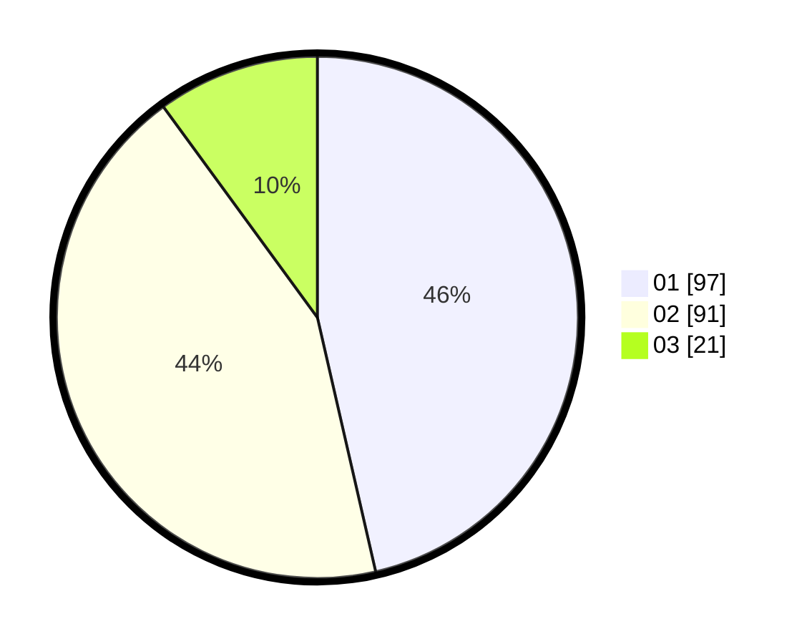

# Hasil

Hasil perolehan suara paslon dapat dilihat pada file paslon-01.txt, paslon-02.txt, dan paslon-03.txt.

Jika tidak ada, artinya data tersebut belum ada pada SIREKAP.

## Perolehan Suara

 * Paslon 01: **97**.
 * Paslon 02: **91**.
 * Paslon 03: **21**.

## Foto C Plano

https://sirekap-obj-formc.kpu.go.id/abea/pemilu/ppwp/31/73/01/10/03/3173011003081-20240216-020411--cb8d877b-afde-47c4-b59d-5a69b7fbf0dc.jpg

https://sirekap-obj-formc.kpu.go.id/abea/pemilu/ppwp/31/73/01/10/03/3173011003081-20240216-020412--77ae5ef4-a427-4183-952d-c0b8ce603f25.jpg

https://sirekap-obj-formc.kpu.go.id/abea/pemilu/ppwp/31/73/01/10/03/3173011003081-20240214-155134--355bbefc-ac19-4406-9884-da20e9f3987e.jpg

## DATA PEMILIH TETAP

Jumlah pemilih dalam DPT: **268**.
 * L: **142**.
 * P: **126**.

## DATA PENGGUNA HAK PILIH

Jumlah pengguna hak pilih dalam DPT: **201**.
 * L: **106**.
 * P: **95**.

Jumlah pengguna hak pilih dalam DPTb: **0**.
 * L: **0**.
 * P: **0**.

Jumlah pengguna hak pilih dalam DPK: **9**.
 * L: **3**.
 * P: **6**.

Jumlah pengguna hak pilih: **210**.
 * L: **109**.
 * P: **101**.

## JUMLAH SUARA SAH DAN TIDAK SAH

JUMLAH SELURUH SUARA SAH: **209**.

JUMLAH SUARA TIDAK SAH: **1**.

JUMLAH SELURUH SUARA SAH DAN SUARA TIDAK SAH: **210**.
