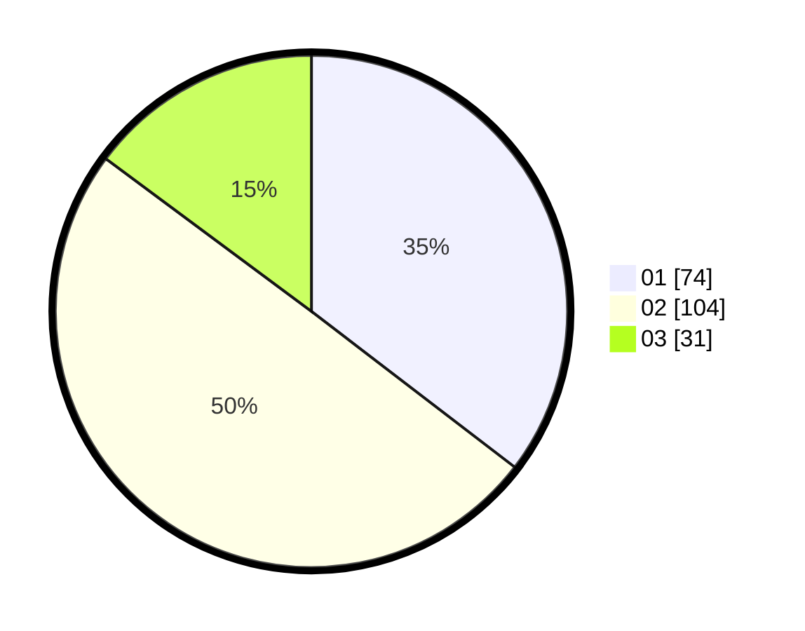

# Hasil

Hasil perolehan suara paslon dapat dilihat pada file paslon-01.txt, paslon-02.txt, dan paslon-03.txt.

Jika tidak ada, artinya data tersebut belum ada pada SIREKAP.

## Perolehan Suara

 * Paslon 01: **74**.
 * Paslon 02: **104**.
 * Paslon 03: **31**.

## Foto C Plano

https://sirekap-obj-formc.kpu.go.id/ec83/pemilu/ppwp/31/73/01/10/03/3173011003091-20240214-155708--40a01e7b-a91b-4c5e-b11f-a93068f97329.jpg

https://sirekap-obj-formc.kpu.go.id/ec83/pemilu/ppwp/31/73/01/10/03/3173011003091-20240214-155855--12977b8f-2cc2-498a-9964-c10ff8228962.jpg

https://sirekap-obj-formc.kpu.go.id/ec83/pemilu/ppwp/31/73/01/10/03/3173011003091-20240214-155306--ccc00df0-34ed-49e6-8389-390b2f18bb2b.jpg

## DATA PEMILIH TETAP

Jumlah pemilih dalam DPT: **267**.
 * L: **127**.
 * P: **140**.

## DATA PENGGUNA HAK PILIH

Jumlah pengguna hak pilih dalam DPT: **208**.
 * L: **99**.
 * P: **109**.

Jumlah pengguna hak pilih dalam DPTb: **0**.
 * L: **0**.
 * P: **0**.

Jumlah pengguna hak pilih dalam DPK: **2**.
 * L: **1**.
 * P: **1**.

Jumlah pengguna hak pilih: **210**.
 * L: **100**.
 * P: **110**.

## JUMLAH SUARA SAH DAN TIDAK SAH

JUMLAH SELURUH SUARA SAH: **209**.

JUMLAH SUARA TIDAK SAH: **1**.

JUMLAH SELURUH SUARA SAH DAN SUARA TIDAK SAH: **210**.
