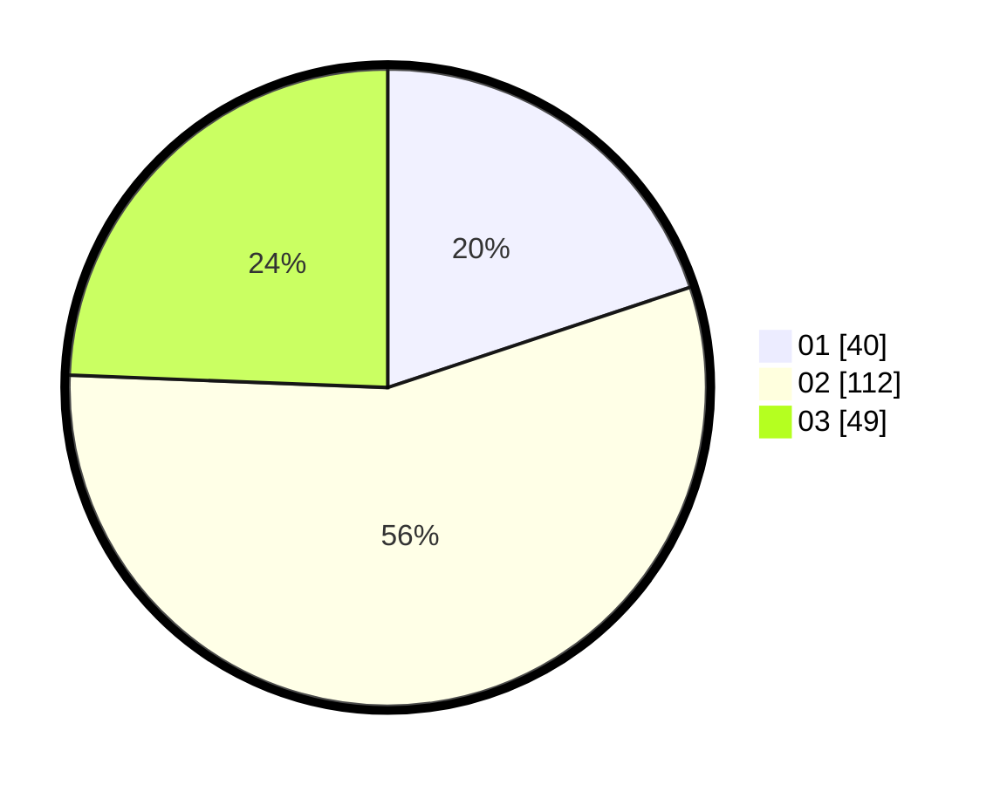

# Hasil

Hasil perolehan suara paslon dapat dilihat pada file paslon-01.txt, paslon-02.txt, dan paslon-03.txt.

Jika tidak ada, artinya data tersebut belum ada pada SIREKAP.

## Perolehan Suara

 * Paslon 01: **40**.
 * Paslon 02: **112**.
 * Paslon 03: **49**.

## Foto C Plano

https://sirekap-obj-formc.kpu.go.id/f5a1/pemilu/ppwp/31/73/01/10/03/3173011003094-20240216-183105--41139524-e3f8-4fcb-badb-d4d2fe4d2181.jpg

https://sirekap-obj-formc.kpu.go.id/f5a1/pemilu/ppwp/31/73/01/10/03/3173011003094-20240216-183106--b1484ff8-b960-4a0c-9498-e50f4d83367f.jpg

https://sirekap-obj-formc.kpu.go.id/f5a1/pemilu/ppwp/31/73/01/10/03/3173011003094-20240216-183105--371d9730-0d62-400d-8519-b9a1357a42f9.jpg

## DATA PEMILIH TETAP

Jumlah pemilih dalam DPT: **263**.
 * L: **135**.
 * P: **128**.

## DATA PENGGUNA HAK PILIH

Jumlah pengguna hak pilih dalam DPT: **199**.
 * L: **99**.
 * P: **100**.

Jumlah pengguna hak pilih dalam DPTb: **5**.
 * L: **0**.
 * P: **5**.

Jumlah pengguna hak pilih dalam DPK: **2**.
 * L: **1**.
 * P: **1**.

Jumlah pengguna hak pilih: **206**.
 * L: **100**.
 * P: **106**.

## JUMLAH SUARA SAH DAN TIDAK SAH

JUMLAH SELURUH SUARA SAH: **201**.

JUMLAH SUARA TIDAK SAH: **5**.

JUMLAH SELURUH SUARA SAH DAN SUARA TIDAK SAH: **206**.
