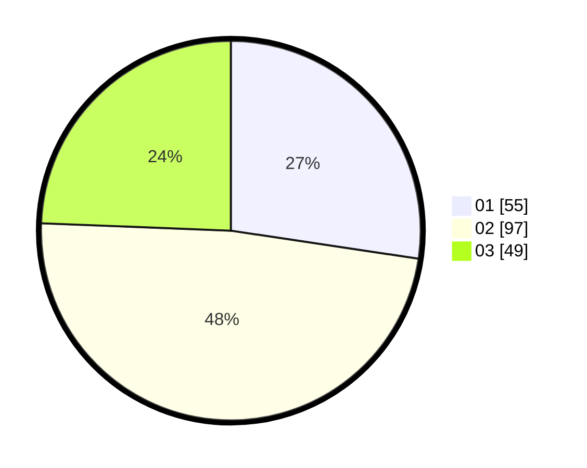

# Hasil

Hasil perolehan suara paslon dapat dilihat pada file paslon-01.txt, paslon-02.txt, dan paslon-03.txt.

Jika tidak ada, artinya data tersebut belum ada pada SIREKAP.

## Perolehan Suara

 * Paslon 01: **55**.
 * Paslon 02: **97**.
 * Paslon 03: **49**.

## Foto C Plano

https://sirekap-obj-formc.kpu.go.id/2678/pemilu/ppwp/31/73/01/10/03/3173011003095-20240215-230807--dc48b1b9-98d1-4d58-9ef1-a6d4d511d900.jpg

https://sirekap-obj-formc.kpu.go.id/2678/pemilu/ppwp/31/73/01/10/03/3173011003095-20240215-230808--de9a6086-e20d-4143-ab40-d3857f8c0cee.jpg

https://sirekap-obj-formc.kpu.go.id/2678/pemilu/ppwp/31/73/01/10/03/3173011003095-20240215-230807--bd2302df-f350-4618-8ff8-dac1ad5a49d7.jpg

## DATA PEMILIH TETAP

Jumlah pemilih dalam DPT: **273**.
 * L: **133**.
 * P: **140**.

## DATA PENGGUNA HAK PILIH

Jumlah pengguna hak pilih dalam DPT: **199**.
 * L: **92**.
 * P: **107**.

Jumlah pengguna hak pilih dalam DPTb: **6**.
 * L: **0**.
 * P: **6**.

Jumlah pengguna hak pilih dalam DPK: **0**.
 * L: **0**.
 * P: **0**.

Jumlah pengguna hak pilih: **205**.
 * L: **92**.
 * P: **113**.

## JUMLAH SUARA SAH DAN TIDAK SAH

JUMLAH SELURUH SUARA SAH: **201**.

JUMLAH SUARA TIDAK SAH: **4**.

JUMLAH SELURUH SUARA SAH DAN SUARA TIDAK SAH: **205**.
