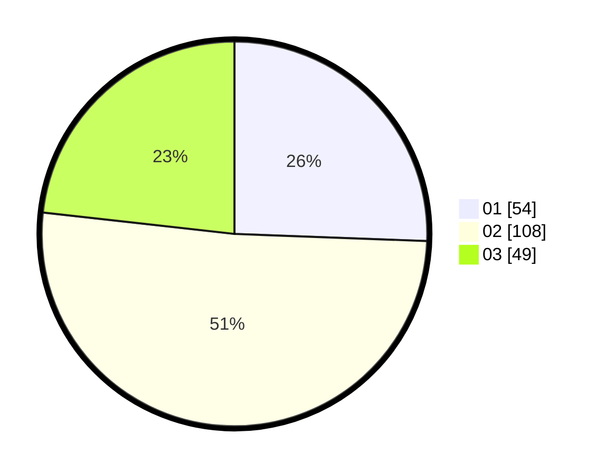

# Hasil

Hasil perolehan suara paslon dapat dilihat pada file paslon-01.txt, paslon-02.txt, dan paslon-03.txt.

Jika tidak ada, artinya data tersebut belum ada pada SIREKAP.

## Perolehan Suara

 * Paslon 01: **54**.
 * Paslon 02: **108**.
 * Paslon 03: **49**.

## Foto C Plano

https://sirekap-obj-formc.kpu.go.id/81c3/pemilu/ppwp/31/73/01/10/03/3173011003096-20240215-232429--f6f68753-5a2e-40a0-a4fb-8e812b471fbf.jpg

https://sirekap-obj-formc.kpu.go.id/81c3/pemilu/ppwp/31/73/01/10/03/3173011003096-20240215-232434--164e4192-a08a-401d-ada1-560d12b9cd8d.jpg

https://sirekap-obj-formc.kpu.go.id/81c3/pemilu/ppwp/31/73/01/10/03/3173011003096-20240215-232431--6760b95e-7625-4894-9b85-9fdda3f3d552.jpg

## DATA PEMILIH TETAP

Jumlah pemilih dalam DPT: **277**.
 * L: **143**.
 * P: **134**.

## DATA PENGGUNA HAK PILIH

Jumlah pengguna hak pilih dalam DPT: **208**.
 * L: **112**.
 * P: **96**.

Jumlah pengguna hak pilih dalam DPTb: **0**.
 * L: **0**.
 * P: **0**.

Jumlah pengguna hak pilih dalam DPK: **5**.
 * L: **1**.
 * P: **4**.

Jumlah pengguna hak pilih: **213**.
 * L: **113**.
 * P: **100**.

## JUMLAH SUARA SAH DAN TIDAK SAH

JUMLAH SELURUH SUARA SAH: **211**.

JUMLAH SUARA TIDAK SAH: **2**.

JUMLAH SELURUH SUARA SAH DAN SUARA TIDAK SAH: **213**.
