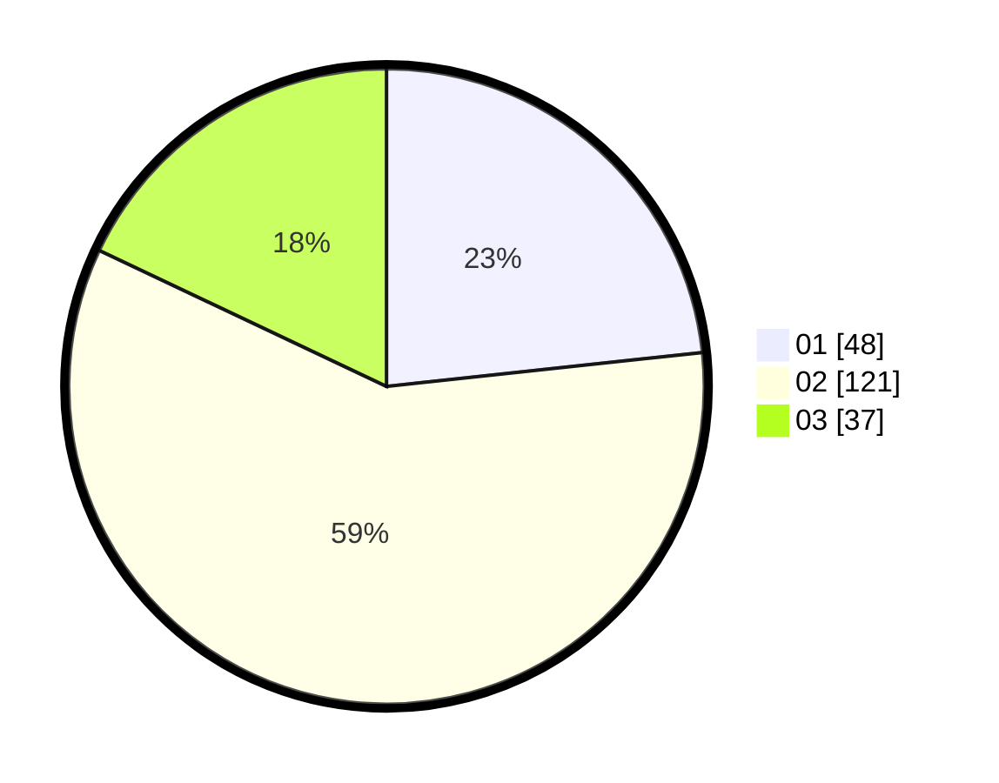

# Hasil

Hasil perolehan suara paslon dapat dilihat pada file paslon-01.txt, paslon-02.txt, dan paslon-03.txt.

Jika tidak ada, artinya data tersebut belum ada pada SIREKAP.

## Perolehan Suara

 * Paslon 01: **48**.
 * Paslon 02: **121**.
 * Paslon 03: **37**.

## Foto C Plano

https://sirekap-obj-formc.kpu.go.id/5721/pemilu/ppwp/31/73/01/10/03/3173011003097-20240216-024110--83e79fab-503a-46ba-bbcd-f691ebb9e865.jpg

https://sirekap-obj-formc.kpu.go.id/5721/pemilu/ppwp/31/73/01/10/03/3173011003097-20240216-024124--8121dfc8-2874-4abc-9882-4e22fce094a5.jpg

https://sirekap-obj-formc.kpu.go.id/5721/pemilu/ppwp/31/73/01/10/03/3173011003097-20240216-024448--18f02c15-5fab-4278-8b52-674dd83c172a.jpg

## DATA PEMILIH TETAP

Jumlah pemilih dalam DPT: **267**.
 * L: **140**.
 * P: **127**.

## DATA PENGGUNA HAK PILIH

Jumlah pengguna hak pilih dalam DPT: **208**.
 * L: **103**.
 * P: **105**.

Jumlah pengguna hak pilih dalam DPTb: **0**.
 * L: **0**.
 * P: **0**.

Jumlah pengguna hak pilih dalam DPK: **4**.
 * L: **1**.
 * P: **3**.

Jumlah pengguna hak pilih: **212**.
 * L: **104**.
 * P: **108**.

## JUMLAH SUARA SAH DAN TIDAK SAH

JUMLAH SELURUH SUARA SAH: **206**.

JUMLAH SUARA TIDAK SAH: **6**.

JUMLAH SELURUH SUARA SAH DAN SUARA TIDAK SAH: **212**.
