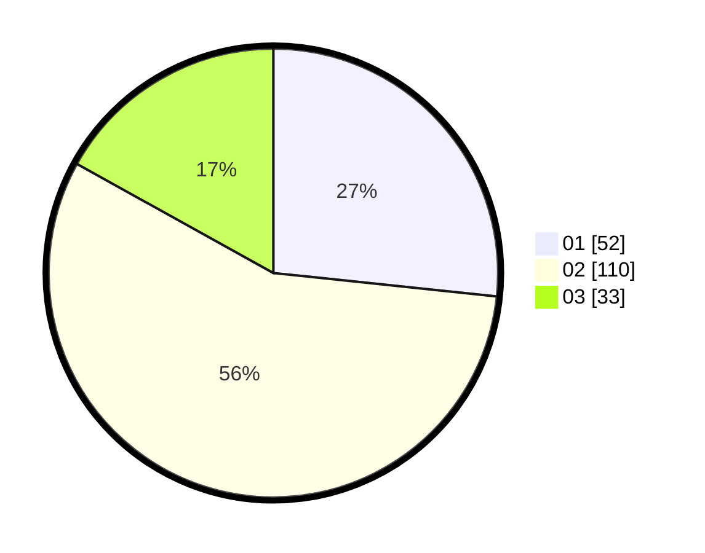

# Hasil

Hasil perolehan suara paslon dapat dilihat pada file paslon-01.txt, paslon-02.txt, dan paslon-03.txt.

Jika tidak ada, artinya data tersebut belum ada pada SIREKAP.

## Perolehan Suara

 * Paslon 01: **52**.
 * Paslon 02: **110**.
 * Paslon 03: **33**.

## Foto C Plano

https://sirekap-obj-formc.kpu.go.id/d1f7/pemilu/ppwp/31/73/01/10/03/3173011003099-20240214-191803--b354c57a-2130-4d98-8ce3-968213796493.jpg

https://sirekap-obj-formc.kpu.go.id/d1f7/pemilu/ppwp/31/73/01/10/03/3173011003099-20240214-155445--c612dbf6-6a01-48b9-9d6d-e977ad6d263b.jpg

https://sirekap-obj-formc.kpu.go.id/d1f7/pemilu/ppwp/31/73/01/10/03/3173011003099-20240214-155758--78b101d0-2593-4569-b000-bce7a615c121.jpg

## DATA PEMILIH TETAP

Jumlah pemilih dalam DPT: **275**.
 * L: **150**.
 * P: **125**.

## DATA PENGGUNA HAK PILIH

Jumlah pengguna hak pilih dalam DPT: **275**.
 * L: **150**.
 * P: **125**.

Jumlah pengguna hak pilih dalam DPTb: **0**.
 * L: **0**.
 * P: **0**.

Jumlah pengguna hak pilih dalam DPK: **0**.
 * L: **0**.
 * P: **0**.

Jumlah pengguna hak pilih: **275**.
 * L: **150**.
 * P: **125**.

## JUMLAH SUARA SAH DAN TIDAK SAH

JUMLAH SELURUH SUARA SAH: **195**.

JUMLAH SUARA TIDAK SAH: **7**.

JUMLAH SELURUH SUARA SAH DAN SUARA TIDAK SAH: **202**.
