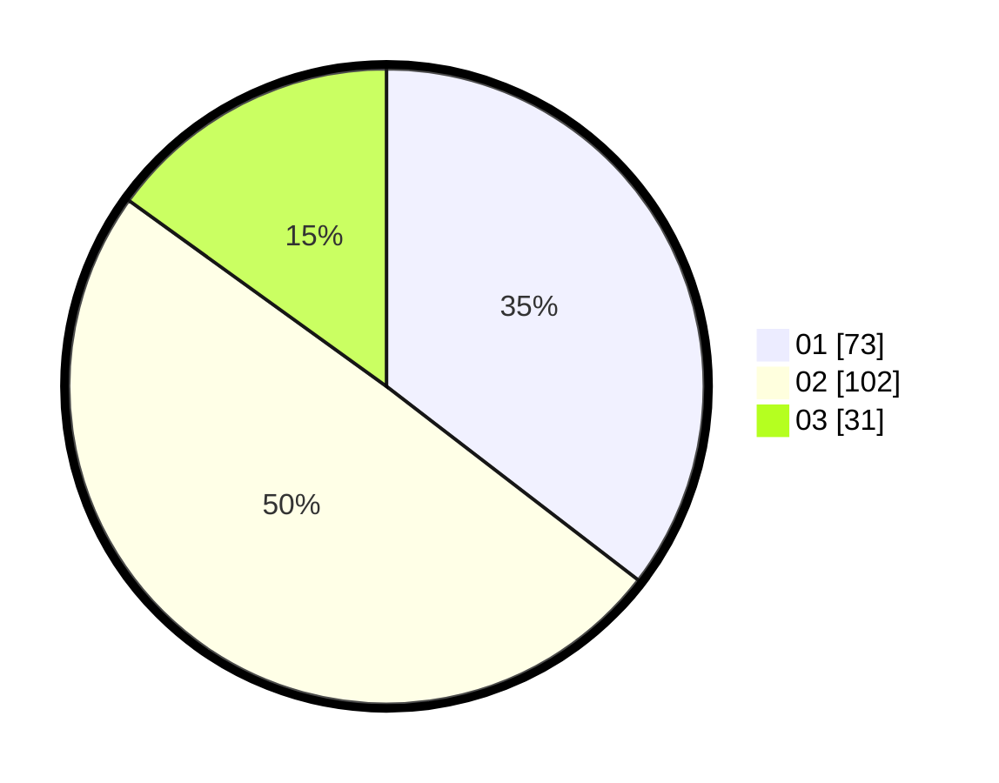

# Hasil

Hasil perolehan suara paslon dapat dilihat pada file paslon-01.txt, paslon-02.txt, dan paslon-03.txt.

Jika tidak ada, artinya data tersebut belum ada pada SIREKAP.

## Perolehan Suara

 * Paslon 01: **73**.
 * Paslon 02: **102**.
 * Paslon 03: **31**.

## Foto C Plano

https://sirekap-obj-formc.kpu.go.id/ee67/pemilu/ppwp/31/73/01/10/03/3173011003110-20240216-011633--c7b5fe1e-4e3e-4de5-a295-a2770abcae97.jpg

https://sirekap-obj-formc.kpu.go.id/ee67/pemilu/ppwp/31/73/01/10/03/3173011003110-20240216-011642--0ae30a4e-72b7-48a5-a30e-0a1e377d8ff6.jpg

https://sirekap-obj-formc.kpu.go.id/ee67/pemilu/ppwp/31/73/01/10/03/3173011003110-20240216-011634--4ba6fe1f-cf8e-4e36-a2a1-aff621d88035.jpg

## DATA PEMILIH TETAP

Jumlah pemilih dalam DPT: **264**.
 * L: **138**.
 * P: **126**.

## DATA PENGGUNA HAK PILIH

Jumlah pengguna hak pilih dalam DPT: **205**.
 * L: **105**.
 * P: **100**.

Jumlah pengguna hak pilih dalam DPTb: **2**.
 * L: **1**.
 * P: **1**.

Jumlah pengguna hak pilih dalam DPK: **2**.
 * L: **1**.
 * P: **1**.

Jumlah pengguna hak pilih: **209**.
 * L: **107**.
 * P: **102**.

## JUMLAH SUARA SAH DAN TIDAK SAH

JUMLAH SELURUH SUARA SAH: **206**.

JUMLAH SUARA TIDAK SAH: **3**.

JUMLAH SELURUH SUARA SAH DAN SUARA TIDAK SAH: **209**.
