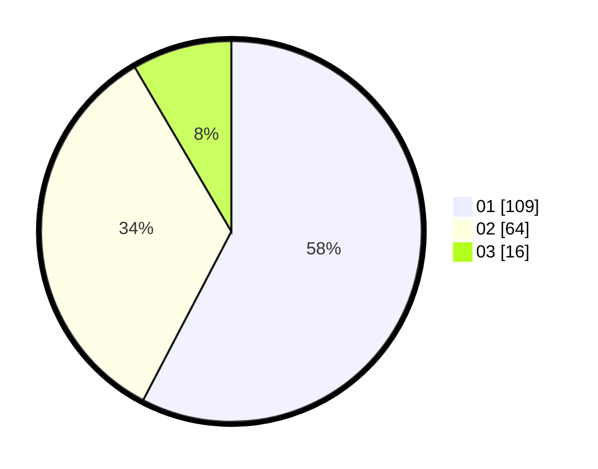

# Hasil

Hasil perolehan suara paslon dapat dilihat pada file paslon-01.txt, paslon-02.txt, dan paslon-03.txt.

Jika tidak ada, artinya data tersebut belum ada pada SIREKAP.

## Perolehan Suara

 * Paslon 01: **109**.
 * Paslon 02: **64**.
 * Paslon 03: **16**.

## Foto C Plano

https://sirekap-obj-formc.kpu.go.id/6de2/pemilu/ppwp/31/73/01/10/03/3173011003112-20240214-214843--174e5b9a-c17f-4957-9307-614a77ecc24b.jpg

https://sirekap-obj-formc.kpu.go.id/6de2/pemilu/ppwp/31/73/01/10/03/3173011003112-20240215-193220--e4bcf50b-5f47-406f-86ea-b828774db7b3.jpg
