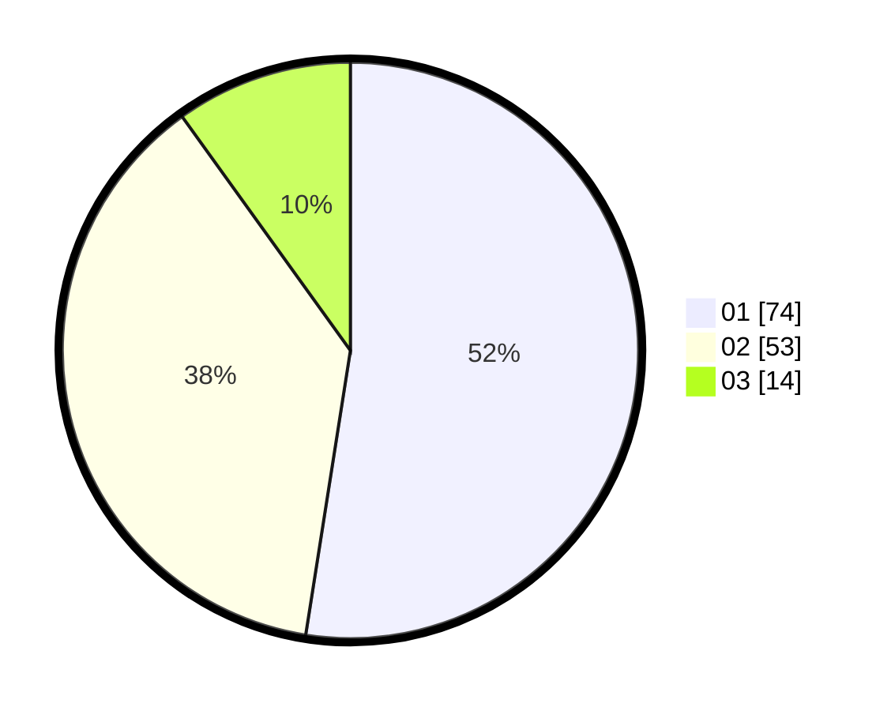

# Hasil

Hasil perolehan suara paslon dapat dilihat pada file paslon-01.txt, paslon-02.txt, dan paslon-03.txt.

Jika tidak ada, artinya data tersebut belum ada pada SIREKAP.

## Perolehan Suara

 * Paslon 01: **74**.
 * Paslon 02: **53**.
 * Paslon 03: **14**.

## Foto C Plano

https://sirekap-obj-formc.kpu.go.id/a79c/pemilu/ppwp/31/73/01/10/03/3173011003118-20240214-231629--577707cf-4210-41ab-a3fb-a0495f22ef92.jpg

https://sirekap-obj-formc.kpu.go.id/a79c/pemilu/ppwp/31/73/01/10/03/3173011003118-20240214-231858--540ac3b8-1f2c-4bd5-a590-3ebb8880166d.jpg

https://sirekap-obj-formc.kpu.go.id/a79c/pemilu/ppwp/31/73/01/10/03/3173011003118-20240214-232034--767b05fb-e0af-4d9e-a2d6-3c55d1884103.jpg
