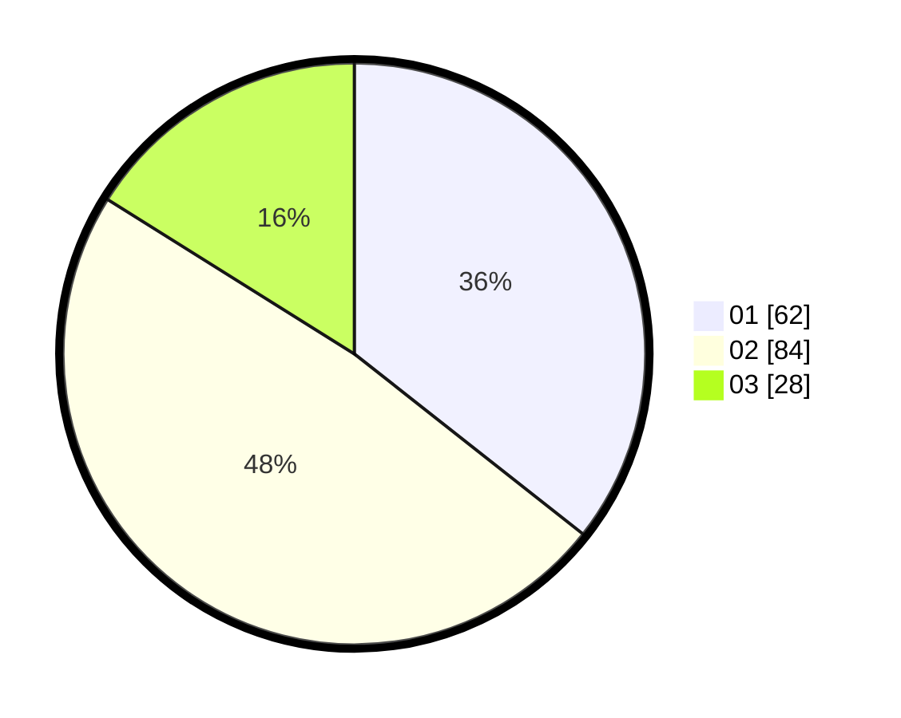

# Hasil

Hasil perolehan suara paslon dapat dilihat pada file paslon-01.txt, paslon-02.txt, dan paslon-03.txt.

Jika tidak ada, artinya data tersebut belum ada pada SIREKAP.

## Perolehan Suara

 * Paslon 01: **62**.
 * Paslon 02: **84**.
 * Paslon 03: **28**.

## Foto C Plano

https://sirekap-obj-formc.kpu.go.id/b9bf/pemilu/ppwp/31/73/01/10/03/3173011003119-20240214-222559--4511b0a5-155f-4a11-a4c7-7a492084f0e7.jpg

https://sirekap-obj-formc.kpu.go.id/b9bf/pemilu/ppwp/31/73/01/10/03/3173011003119-20240214-220537--274bd773-6e62-455f-b4cd-67e774fe6d27.jpg

https://sirekap-obj-formc.kpu.go.id/b9bf/pemilu/ppwp/31/73/01/10/03/3173011003119-20240214-220405--f962e0bc-9a0a-4ea8-bf2d-86c4cc7f785f.jpg
