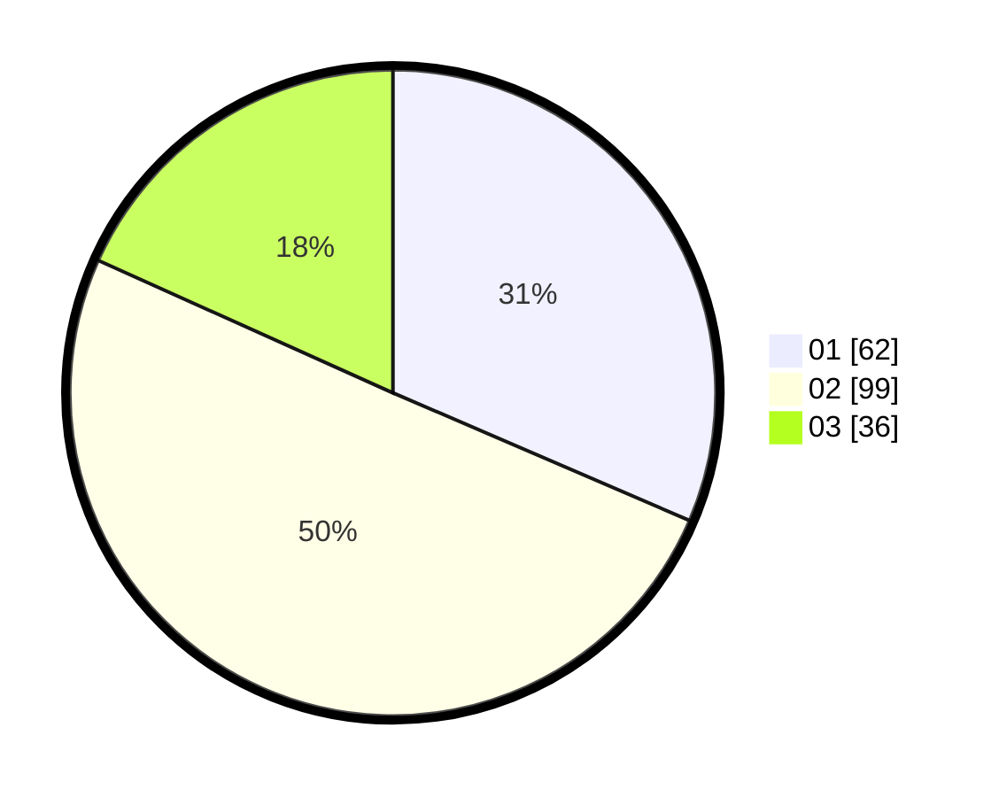

# Hasil

Hasil perolehan suara paslon dapat dilihat pada file paslon-01.txt, paslon-02.txt, dan paslon-03.txt.

Jika tidak ada, artinya data tersebut belum ada pada SIREKAP.

## Perolehan Suara

 * Paslon 01: **62**.
 * Paslon 02: **99**.
 * Paslon 03: **36**.

## Foto C Plano

https://sirekap-obj-formc.kpu.go.id/938f/pemilu/ppwp/31/73/01/10/03/3173011003121-20240215-225820--e278f8cf-0fab-4d8d-a4c2-048433629db3.jpg

https://sirekap-obj-formc.kpu.go.id/938f/pemilu/ppwp/31/73/01/10/03/3173011003121-20240215-225825--5783245f-ccc7-4fb0-a83c-c1082b52afbe.jpg

https://sirekap-obj-formc.kpu.go.id/938f/pemilu/ppwp/31/73/01/10/03/3173011003121-20240215-225824--11f98a87-4ae5-4459-a9f5-5479aadd1dde.jpg

## DATA PEMILIH TETAP

Jumlah pemilih dalam DPT: **287**.
 * L: **148**.
 * P: **139**.

## DATA PENGGUNA HAK PILIH

Jumlah pengguna hak pilih dalam DPT: **194**.
 * L: **98**.
 * P: **96**.

Jumlah pengguna hak pilih dalam DPTb: **0**.
 * L: **0**.
 * P: **0**.

Jumlah pengguna hak pilih dalam DPK: **0**.
 * L: **0**.
 * P: **0**.

Jumlah pengguna hak pilih: **199**.
 * L: **101**.
 * P: **98**.

## JUMLAH SUARA SAH DAN TIDAK SAH

JUMLAH SELURUH SUARA SAH: **197**.

JUMLAH SUARA TIDAK SAH: **2**.

JUMLAH SELURUH SUARA SAH DAN SUARA TIDAK SAH: **199**.
